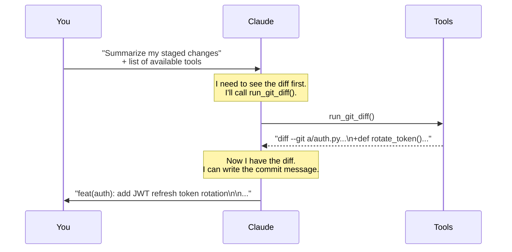
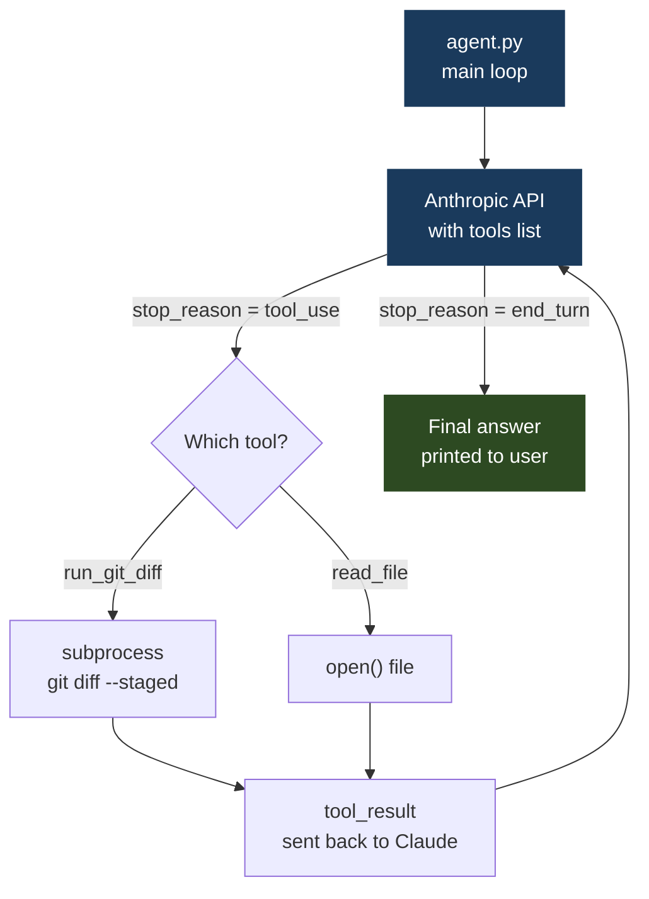

# 01 · git-narrator

> **Concept: Tool Use** — Claude calls functions you define and uses their results to build its answer.

---

## What you will build

An agent that reads your staged git changes and automatically writes:
- A conventional commit message
- A pull request description
- A one-line changelog entry

```bash
$ python3 agent.py
✔ Reading staged changes...
✔ Generating commit message...

Commit message:
  feat(auth): add JWT refresh token rotation

PR description:
  ## What
  Implements refresh token rotation to improve session security...

Changelog:
  - feat: JWT refresh token rotation (auth-service)
```

---

## The concept: Tool Use

Before agents, LLMs were input/output machines. You send text, you get text back.

Tool use changes this: Claude can **call functions** in your code, get their results, and incorporate them into its reasoning.

### How it works — step by step



### The critical piece: tool definition

Claude does not magically know what tools exist. You tell it — in the API call — by passing a list of tool definitions. Each definition has:

1. **name** — what Claude calls it: `"run_git_diff"`
2. **description** — why Claude would use it: `"Returns the staged git diff"`
3. **input_schema** — what arguments it takes (JSON Schema)

```python
{
    "name": "run_git_diff",
    "description": "Returns the staged git diff (git diff --staged). "
                   "Use this to see exactly what code changes are about to be committed.",
    "input_schema": {
        "type": "object",
        "properties": {}   # no arguments needed
    }
}
```

Claude reads this description and decides: *"the user wants a commit message, I need the diff first, I should call run_git_diff."*

**The description is everything.** A bad description = Claude won't call the tool at the right time.

### What the API response looks like

When Claude wants to call a tool, it returns a response with `stop_reason = "tool_use"` and a `tool_use` block:

```python
# Claude's response when it wants to call a tool
{
  "stop_reason": "tool_use",
  "content": [
    {
      "type": "tool_use",
      "id": "toolu_01abc123",
      "name": "run_git_diff",
      "input": {}
    }
  ]
}
```

Your code then:
1. Sees `stop_reason == "tool_use"`
2. Finds the tool in its registry
3. Calls the actual Python function
4. Sends the result back to Claude as a `tool_result` message
5. Claude continues and produces its final answer

---

## Architecture



---

## File structure

```
01-git-narrator/
├── README.md       ← you are here
├── tools.py        ← tool definitions + implementations
├── agent.py        ← the agent loop (30 lines)
└── run.sh          ← demo script
```

---

## Step-by-step walkthrough

### Step 1 — Define a tool

Open `tools.py`. A tool has two parts:

**Part A: the definition** (what Claude sees)
```python
{
    "name": "run_git_diff",
    "description": "Returns the currently staged git diff.",
    "input_schema": {"type": "object", "properties": {}}
}
```

**Part B: the implementation** (what your code runs)
```python
def run_git_diff() -> str:
    result = subprocess.run(
        ["git", "diff", "--staged"],
        capture_output=True, text=True
    )
    return result.stdout or "No staged changes found."
```

### Step 2 — Call Claude with tools

In `agent.py`, you pass the tool definitions alongside your message:

```python
response = client.messages.create(
    model="claude-sonnet-4-6",
    max_tokens=1024,
    tools=TOOL_DEFINITIONS,        # ← Claude knows these tools exist
    messages=[{"role": "user", "content": user_message}]
)
```

### Step 3 — Handle the tool call

```python
if response.stop_reason == "tool_use":
    for block in response.content:
        if block.type == "tool_use":
            # Call the actual Python function
            result = dispatch(block.name, block.input)

            # Send the result back to Claude
            messages.append({"role": "assistant", "content": response.content})
            messages.append({
                "role": "user",
                "content": [{
                    "type": "tool_result",
                    "tool_use_id": block.id,
                    "content": result
                }]
            })
```

### Step 4 — Claude produces the final answer

After receiving the tool result, Claude now has everything it needs and returns `stop_reason = "end_turn"` with the final text.

---

## Run it

### Prerequisites

- Python 3.10+ (the agent uses `match` statements)
- An Anthropic API key ([get one here](https://console.anthropic.com/))
- A git repository with at least one commit (needed for `get_commit_history`)

Create a virtual environment and install the dependency:

```bash
python3 -m venv .venv
source .venv/bin/activate
pip install anthropic
```

> The `.venv/` directory is git-ignored. Next time you open a new terminal, reactivate with `source .venv/bin/activate` before running the agent.

Export your API key (or prefix every `python` command with it):

```bash
export ANTHROPIC_API_KEY=your_key_here
```

---

### Option A — Run against your own staged changes

This is the real use-case. Stage any change in any git repo, then run the agent:

```bash
cd 01-git-narrator

# 1. Make a change in your repo and stage it
git add some_file.py

# 2. Run the agent from the same directory
python3 agent.py
```

The agent will:
1. Call `run_git_diff` → reads your staged diff via `git diff --staged`
2. Call `get_commit_history` → reads recent commits to match your style
3. Return a conventional commit message, PR description, and changelog entry

Expected output:

```
git-narrator — AI commit message generator
─────────────────────────────────────────────
Analyzing staged changes...

  → calling tool: run_git_diff({})
  → calling tool: get_commit_history({'count': 5})

**Commit message:**
feat(auth): add JWT refresh token rotation

**PR description:**
## What
Implements refresh token rotation in `auth.py`. Each login invalidates
the previous refresh token and issues a new one, preventing token reuse.

## Why
Mitigates session hijacking risk when a refresh token is leaked.

**Changelog:**
- feat: JWT refresh token rotation (auth-service)
```

> **Note:** If there are no staged changes, `run_git_diff` returns `"No staged changes found."` and Claude will tell you there is nothing to summarize. Always run `git add` first.

---

### Option B — Run the demo script

If you don't have changes to stage, `run.sh` creates a fake Python file, stages it, runs the agent, then cleans up:

```bash
cd 01-git-narrator
bash run.sh
```

What the script does step by step:
1. Checks you're inside a git repository (exits with a clear error if not)
2. Writes a small `demo_auth.py` file with a `rotate_refresh_token` function
3. Stages it with `git add demo_auth.py`
4. Runs `python3 agent.py` — you see the full tool-call loop
5. Unstages and deletes `demo_auth.py` so your repo stays clean

> **Tip:** If you're not in a git repo yet, initialize one first:
> ```bash
> git init && git commit --allow-empty -m "initial commit"
> ```

---

### Troubleshooting

| Symptom | Likely cause | Fix |
|---|---|---|
| `AuthenticationError` | API key missing or wrong | Check `echo $ANTHROPIC_API_KEY` |
| `SyntaxError` on `match` | Python < 3.10 | Run `python3 --version`, upgrade if needed |
| `No staged changes found` | Nothing staged | Run `git add <file>` first |
| `git error: ...` | Not in a git repo | `cd` into a repo or run `git init` |
| `ModuleNotFoundError: anthropic` | venv not active or package not installed | `source .venv/bin/activate && pip install anthropic` |

---

## Exercises

Once you have it running, try these modifications:

1. **Add a tool** — create a `get_branch_name()` tool that runs `git branch --show-current` and include the branch name in the commit message context.

2. **Change the description** — deliberately write a bad tool description (e.g. "this tool does stuff") and see how Claude's behavior changes.

3. **Add an argument** — modify `run_git_diff` to accept a `file_path` argument so Claude can request the diff for a specific file.

---

## Key takeaways

- Claude **never calls your Python functions directly** — it returns a structured JSON request, you run the function, you send back the result
- The **description is the interface** — Claude decides when and how to use tools based purely on your descriptions
- Tools are **stateless** — each tool call is independent; Claude maintains the reasoning context, not the tools
