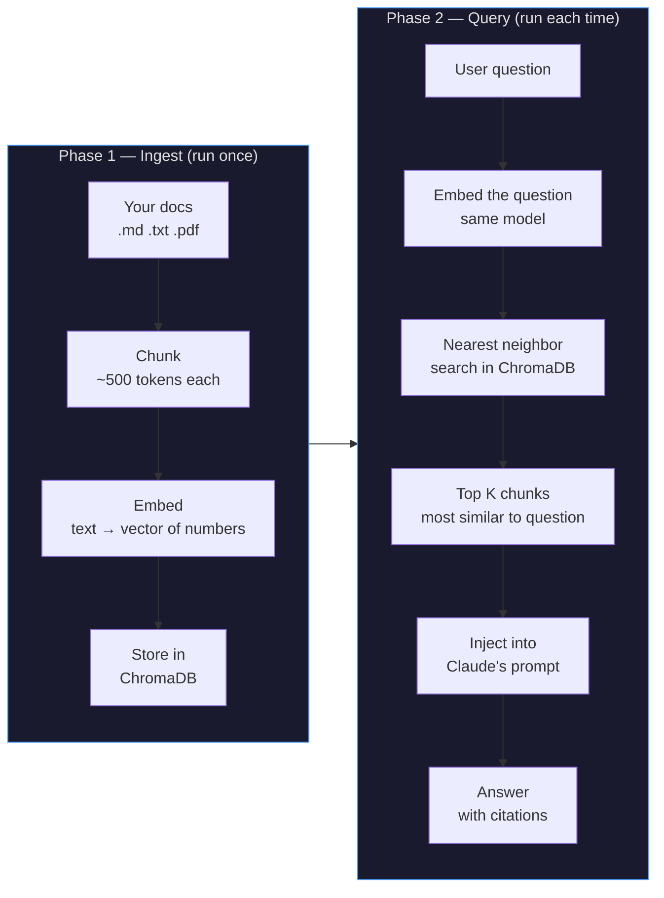
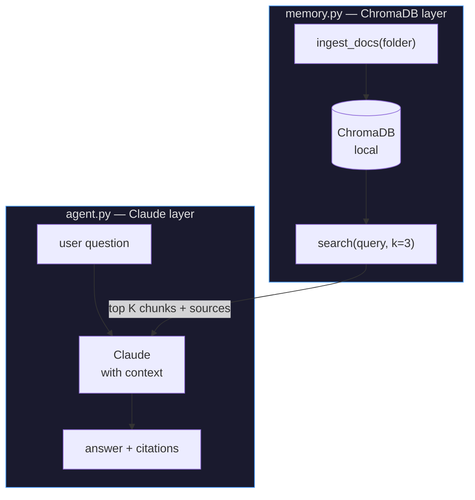

# 02 · doc-oracle

> **Concept: RAG + Semantic Memory** — the agent searches a vector database of your documents before answering. It cites its sources.

---

## What you will build

An agent that answers questions about your own documents (runbooks, ADRs, READMEs, etc.) by finding the most relevant passages first.

```bash
$ python agent.py "how do we rollback a failed deploy?"

Searching docs...
  → found 3 relevant passages in: runbook-deploy.md, adr-012.md

Answer:
  To rollback a failed deploy, run:
    kubectl rollout undo deployment/<name> -n production

  This reverts to the previous ReplicaSet. If the issue is
  in a config change, check adr-012.md which covers the
  config versioning strategy.

Sources:
  - runbook-deploy.md (relevance: 0.91)
  - adr-012.md (relevance: 0.74)
```

---

## The concept: RAG

RAG stands for **Retrieval-Augmented Generation**.

The problem it solves: Claude's training data has a cutoff date and doesn't include *your* internal docs. You can't fit 500 pages of documentation into a single prompt either.

The solution: **search first, then answer**.

### The two phases



### What is an embedding?

An embedding converts text into a list of numbers (a vector) that captures its *meaning*. Similar texts produce similar vectors.

```
"how to rollback a deploy"   → [0.12, -0.34, 0.89, ...]  ← 1536 numbers
"revert a kubernetes deploy" → [0.11, -0.31, 0.91, ...]  ← very close!
"how to bake a cake"         → [0.87,  0.43, -0.22, ...] ← very different
```

ChromaDB stores these vectors and can find the closest ones to your query in milliseconds — even across thousands of documents.

### Why chunk?

You can't embed an entire document as one vector — you'd lose the fine-grained meaning. Instead you split documents into overlapping chunks of ~500 tokens, embed each chunk separately, and store them with metadata (source file, chunk index).

```
runbook-deploy.md (3000 tokens)
  chunk 0: "## Deployment process\nWe use ArgoCD..."    → embed → store
  chunk 1: "## Rollback procedure\nTo rollback, run..." → embed → store
  chunk 2: "## Monitoring\nAfter deploy, check..."      → embed → store
```

When you ask "how to rollback?", the search finds chunk 1 specifically.

---

## Architecture



---

## File structure

```
02-doc-oracle/
├── README.md
├── memory.py      ← ChromaDB: ingest docs + search
├── agent.py       ← Claude: answer with retrieved context
├── docs/          ← sample documents to query
│   ├── runbook-deploy.md
│   ├── runbook-incidents.md
│   └── architecture.md
└── run.sh
```

---

## Step-by-step walkthrough

### Step 1 — Ingest your documents

`memory.py` reads files, splits them into chunks, embeds them, and stores in ChromaDB:

```python
def ingest_docs(folder: str):
    collection = get_collection()
    for file in Path(folder).glob("**/*.md"):
        text = file.read_text()
        chunks = split_into_chunks(text, size=500, overlap=50)
        for i, chunk in enumerate(chunks):
            collection.add(
                documents=[chunk],
                metadatas=[{"source": str(file), "chunk": i}],
                ids=[f"{file.stem}-{i}"]
            )
```

ChromaDB handles the embedding automatically using a local model — no API calls needed for ingestion.

### Step 2 — Search at query time

```python
def search(query: str, k: int = 3) -> list[dict]:
    results = collection.query(
        query_texts=[query],
        n_results=k,
    )
    # Returns: documents, distances, metadatas
    return [
        {"text": doc, "source": meta["source"], "score": 1 - dist}
        for doc, meta, dist in zip(
            results["documents"][0],
            results["metadatas"][0],
            results["distances"][0],
        )
    ]
```

### Step 3 — Inject into Claude's prompt

```python
# Build context from search results
context = "\n\n---\n\n".join([
    f"Source: {r['source']}\n{r['text']}"
    for r in search_results
])

# Claude now has the relevant passages in its context
messages = [{
    "role": "user",
    "content": f"Using the following documentation:\n\n{context}\n\nAnswer: {question}"
}]
```

### Step 4 — Claude answers with citations

The system prompt instructs Claude to always cite which document it used, and to say "I don't know" if the answer isn't in the provided context.

---

## Run it

```bash
cd 02-doc-oracle
pip install chromadb

# Ingest the sample docs (first time only)
python memory.py --ingest docs/

# Ask a question
python agent.py "how do we handle a database outage?"

# Or interactive mode
python agent.py
```

---

## Exercises

1. **Add your own docs** — drop any `.md` files into `docs/` and re-run `python memory.py --ingest docs/`. Ask questions about them.

2. **Change chunk size** — try `size=100` vs `size=1000`. How does it affect the quality of answers?

3. **Inspect the vectors** — add a `python memory.py --inspect` command that prints the 10 most recently added chunks with their similarity scores for a sample query.

4. **Add a "I don't know" guard** — modify the system prompt so Claude refuses to answer if the retrieved chunks have a relevance score below 0.5.

---

## Key takeaways

- RAG is not a feature of Claude — it's a **pattern you implement** around any LLM
- The quality of answers depends on **chunk quality** more than the LLM
- Citations are not automatic — you must **instruct Claude** to cite sources in the system prompt
- ChromaDB uses a local embedding model by default — you don't need an API for the vector search
