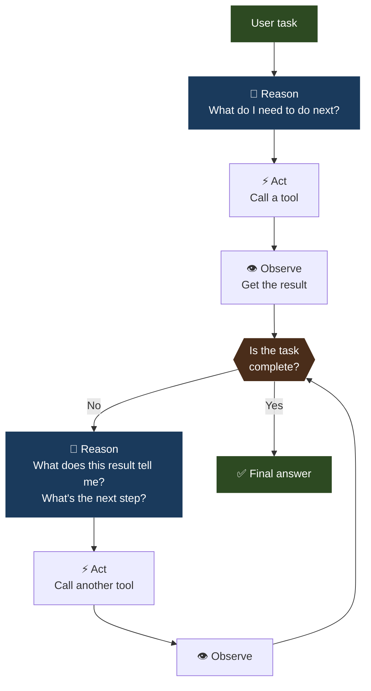
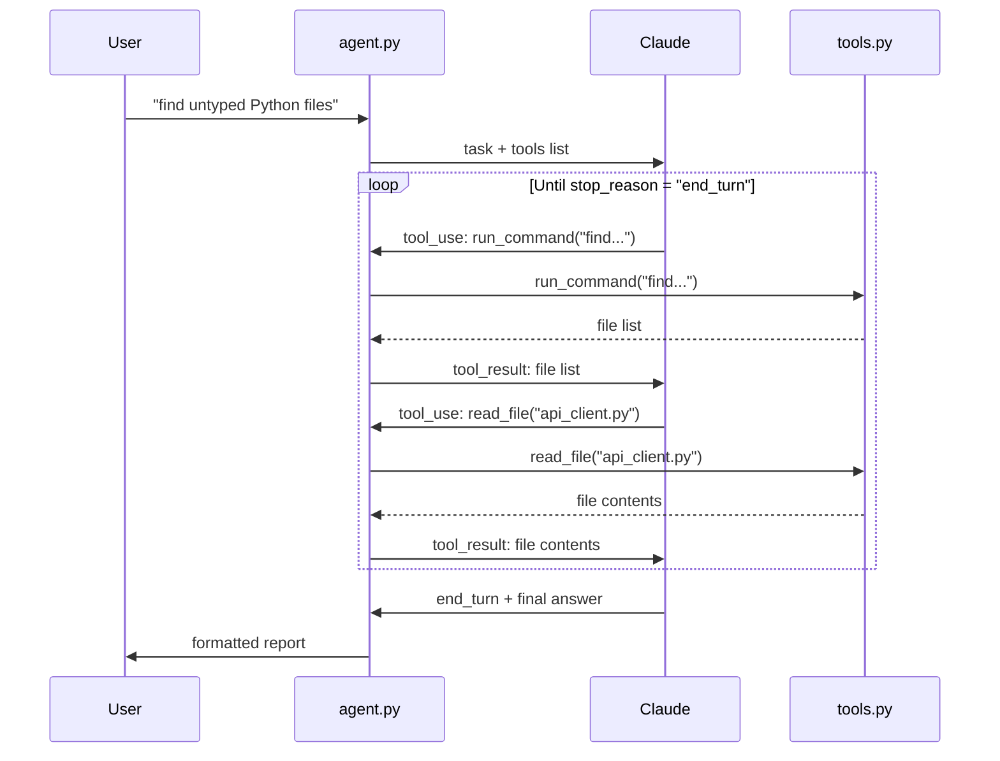

# 03 · shell-pilot

> **Concept: ReAct Loop** — Reason, Act, Observe, repeat. The agent iterates until the task is complete, adapting when commands fail.

---

## What you will build

An agent that receives a natural language task and executes it in the shell — in multiple steps, adapting to results along the way.

```bash
$ python agent.py "find all Python files that import 'requests' but don't have type hints"

[step 1] Thinking: I need to find all .py files first.
[tool]   run_command: find . -name "*.py" -not -path "./.venv/*"
[result] ./src/api_client.py\n./src/fetcher.py\n./tests/test_api.py

[step 2] Thinking: Now I'll check each file for 'import requests' and type hints.
[tool]   run_command: grep -l "import requests" ./src/api_client.py ./src/fetcher.py
[result] ./src/api_client.py\n./src/fetcher.py

[step 3] Thinking: Check for type hints in those files.
[tool]   read_file: ./src/api_client.py
[result] def fetch_user(user_id):  # no type hints here...

─────────────────────────────────────────────────
Files that import 'requests' without type hints:
  - src/api_client.py (3 untyped functions)
  - src/fetcher.py (1 untyped function: fetch_all)
```

---

## The concept: ReAct Loop

ReAct = **Re**ason + **Act**.

The pattern is simple: Claude reasons about what to do, takes one action, observes the result, reasons again, takes another action — and keeps going until the task is done.

### The loop



### What makes this powerful

In projects 01 and 02, Claude called tools once and was done. Here, **Claude decides how many steps to take** and **what to do next based on previous results**.

This is the foundation of every complex agent — the model reasons like a human problem-solver:

> "I don't know the answer directly. Let me look here first. OK, that gives me X. Now I should check Y. That confirms my hypothesis. The answer is Z."

### Error recovery

The agent doesn't just fail when a command returns an error — it reads the error and adapts:

```
[tool]   run_command: python analyze.py --file missing.py
[result] Error: file not found: missing.py

[think]  The file doesn't exist. I should list the directory first
         to see what files are actually there.

[tool]   run_command: ls -la
```

---

## Architecture



---

## File structure

```
03-shell-pilot/
├── README.md
├── tools.py      ← shell tools: run_command, read_file, write_file
├── agent.py      ← the ReAct loop with step-by-step printing
└── run.sh        ← demo tasks to try
```

---

## Step-by-step walkthrough

### Step 1 — The tools

Shell pilot has three tools:

| Tool | What it does | Risk |
|---|---|---|
| `run_command` | Executes a shell command | Medium — destructive commands possible |
| `read_file` | Reads a file | Low |
| `write_file` | Writes/creates a file | Medium |

Notice the safety guardrails in `tools.py` — certain commands are blocked:

```python
BLOCKED_COMMANDS = ["rm -rf", "sudo", "curl | bash", "wget | sh", "> /dev/sda"]

def run_command(command: str) -> str:
    for blocked in BLOCKED_COMMANDS:
        if blocked in command:
            return f"Error: command blocked for safety: {blocked}"
    # proceed...
```

### Step 2 — The loop in agent.py

```python
MAX_STEPS = 15

messages = [{"role": "user", "content": task}]

for step in range(MAX_STEPS):
    response = client.messages.create(...)

    if response.stop_reason == "end_turn":
        break  # ← task complete

    # Process tool calls, get results, append to messages
    # Claude will see all previous tool calls and results
    # in the message history — this is how it "remembers"
    # what it has already done
```

**Key insight**: The "memory" of a ReAct agent is simply the **message history**. Claude sees every tool call and result from the current session. It reasons across all of them simultaneously.

### Step 3 — Why MAX_STEPS matters

Without a step limit, a buggy agent could loop forever (e.g. if a tool always errors and Claude keeps retrying). Always set a maximum.

```python
if step >= MAX_STEPS - 1:
    return "Task incomplete: max steps reached. Last state: " + last_observation
```

---

## Run it

```bash
cd 03-shell-pilot

# Demo tasks
bash run.sh

# Or give your own task
python agent.py "count the number of TODO comments in all Python files"
python agent.py "find files larger than 1MB in the current directory"
python agent.py "check if requirements.txt has any duplicate entries"
```

---

## Exercises

1. **Add a `list_directory` tool** — cleaner than using `run_command("ls")`. Note how Claude's behavior changes when it has a dedicated tool for common operations.

2. **Increase verbosity** — print the full reasoning text (the `text` blocks Claude returns before each tool call). You'll see Claude's actual thought process.

3. **Test error recovery** — ask the agent to read a file that doesn't exist. Watch how it recovers.

4. **Add a confirmation step** — before executing `write_file`, print "About to write to X. Continue? [y/N]" and require user input. This is how you add human-in-the-loop to any agent.

---

## Key takeaways

- A ReAct agent is **just a loop** with a tool-calling LLM inside — no magic
- Claude's "reasoning" between steps is visible in the `text` blocks of its response
- The **message history is the agent's memory** — it grows with each step
- Always set a **MAX_STEPS guard** to prevent infinite loops
- **Safety is your responsibility** — the LLM will call whatever tools you give it
