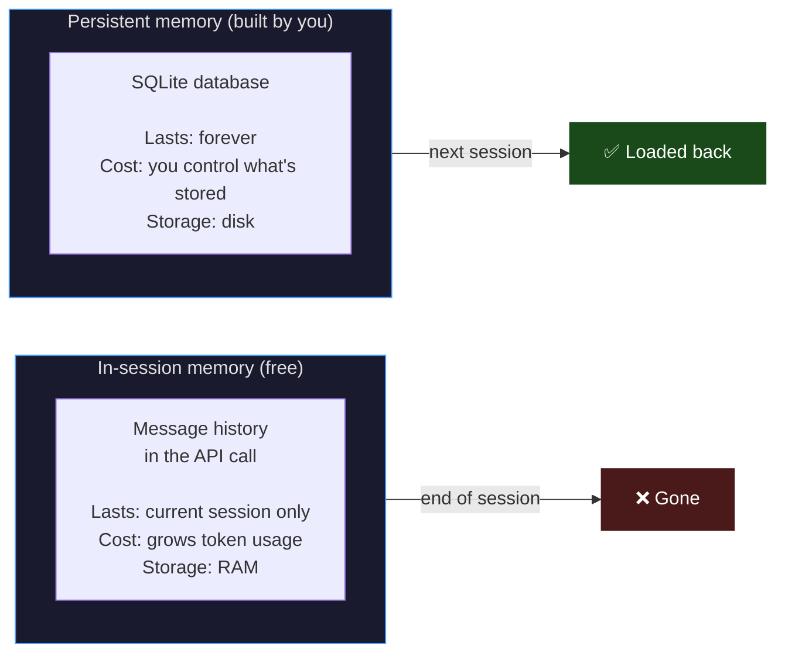
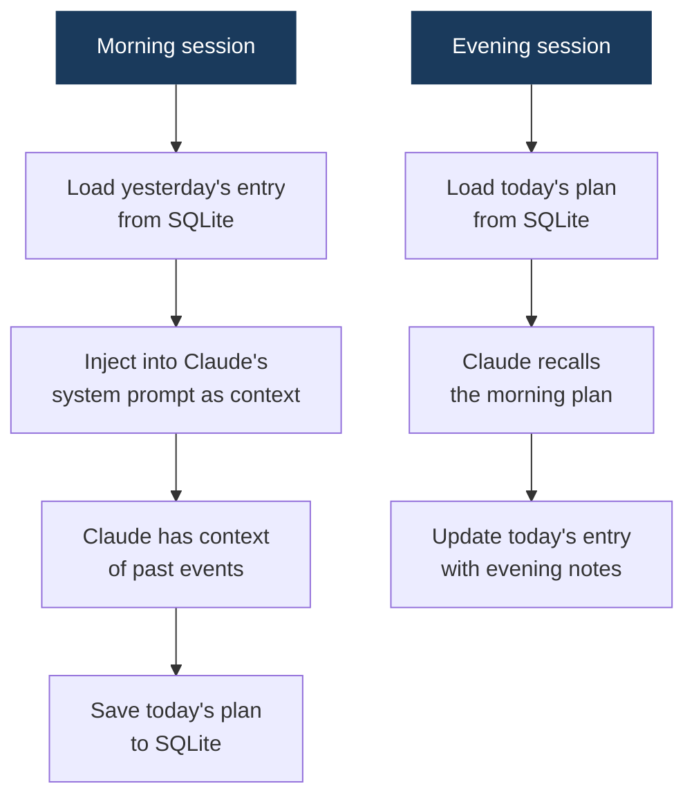
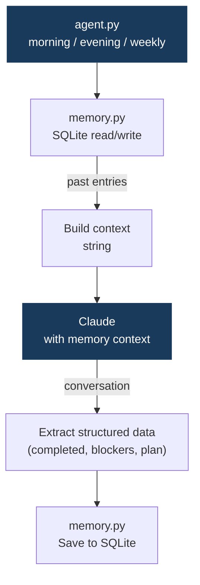

# 04 · standup-bot

> **Concept: Episodic Memory** — the agent remembers what you told it in previous sessions. Context persists across time.

---

## What you will build

A daily standup assistant that:
- **Morning**: recalls your blockers from yesterday, asks what you're working on today
- **Evening**: records what you did, what was completed, what's blocked
- **Friday**: generates a weekly summary for your manager

```bash
# Monday morning
$ python agent.py morning

Good morning! Based on yesterday's notes:
  ⚠ You were blocked on: "flaky auth test — couldn't reproduce locally"
  ✔ You completed: "backend API refactor"

What are you working on today?
> Fixing the flaky test and starting the Vault integration

Got it. Good luck with the test! Let me know tonight how it went.

# Monday evening
$ python agent.py evening

How did today go?
> Fixed the flaky test (race condition in mock). Started Vault setup, hit a config issue.

Saved. Blockers noted: Vault config issue.

# Friday
$ python agent.py weekly

📋 Weekly Summary — Week of May 19

Completed:
  ✔ Backend API refactor
  ✔ Fixed flaky auth test (race condition in mock)

In progress:
  → Vault integration (started Tue)

Blockers this week:
  ⚠ Vault config issue (Mon evening → resolved Wed)

Total: 2 completed, 1 in progress
```

---

## The concept: Episodic Memory

In projects 01–03, the agent forgot everything between runs. Each session started fresh.

Episodic memory changes this: **the agent remembers specific events over time**, like a diary.

### Two types of memory



### How it works



### The memory schema

```python
# Each entry in the SQLite database:
{
    "date": "2026-05-19",
    "morning_plan": "Fix flaky test, start Vault setup",
    "evening_notes": "Fixed test (race condition). Vault config blocked.",
    "completed": ["flaky auth test fix"],
    "blockers": ["Vault config issue"],
    "mood": "productive"  # optional — useful for trends
}
```

### What gets injected into context

Before every conversation, `memory.py` loads relevant past entries and formats them as context:

```python
context = f"""
Yesterday ({yesterday}):
  Plan: {entry.morning_plan}
  Done: {', '.join(entry.completed)}
  Blockers: {', '.join(entry.blockers)}
"""

# This context goes into the system prompt
system = BASE_SYSTEM_PROMPT + "\n\n" + context
```

Claude then treats this as background knowledge — it knows what happened without you having to re-explain.

---

## Architecture



---

## File structure

```
04-standup-bot/
├── README.md
├── memory.py     ← SQLite: load/save daily entries
├── agent.py      ← Claude conversations for morning/evening/weekly
└── run.sh        ← simulates a full week
```

---

## Step-by-step walkthrough

### Step 1 — The memory schema

`memory.py` manages a simple SQLite database with one table:

```sql
CREATE TABLE entries (
    date        TEXT PRIMARY KEY,
    plan        TEXT,
    notes       TEXT,
    completed   TEXT,  -- JSON array
    blockers    TEXT,  -- JSON array
    created_at  TEXT
);
```

### Step 2 — Loading context

```python
def load_context(days_back: int = 3) -> str:
    """Returns a formatted string of the last N days' entries."""
    entries = get_recent_entries(days_back)
    if not entries:
        return "No previous entries found."

    lines = []
    for entry in entries:
        lines.append(f"\n{entry.date}:")
        if entry.plan:
            lines.append(f"  Plan: {entry.plan}")
        if entry.completed:
            lines.append(f"  Completed: {', '.join(entry.completed)}")
        if entry.blockers:
            lines.append(f"  Blockers: {', '.join(entry.blockers)}")
    return "\n".join(lines)
```

### Step 3 — Structured extraction

After the conversation, we ask Claude to extract structured data from what the user said:

```python
# Ask Claude to extract structured info from the conversation
extract_response = client.messages.create(
    model=MODEL,
    messages=[
        *conversation_history,
        {"role": "user", "content": "Extract: completed tasks (list), blockers (list), plan (string)."}
    ],
    # Use structured output to get clean JSON
)
```

---

## Run it

```bash
cd 04-standup-bot

# Morning standup
python agent.py morning

# Evening check-in
python agent.py evening

# Weekly summary
python agent.py weekly

# Simulate a full week (demo)
bash run.sh
```

---

## Exercises

1. **Add a mood tracker** — ask the user to rate their day 1–5 and store it. At weekly summary, show average mood.

2. **Add a search command** — `python agent.py search "Vault"` should find all entries that mention Vault.

3. **Team mode** — add a `--name` flag so multiple team members can use the same database. Generate a team standup report.

4. **Slack integration** — instead of CLI input, read standup entries from a Slack channel using the Slack API.

---

## Key takeaways

- Persistent memory is **not built into Claude** — you build it yourself
- The pattern is always: **load → inject into context → converse → save**
- SQLite is sufficient for most personal/small-team memory needs
- Deciding **what to store** is the hard part — storing everything wastes tokens, storing too little loses context
