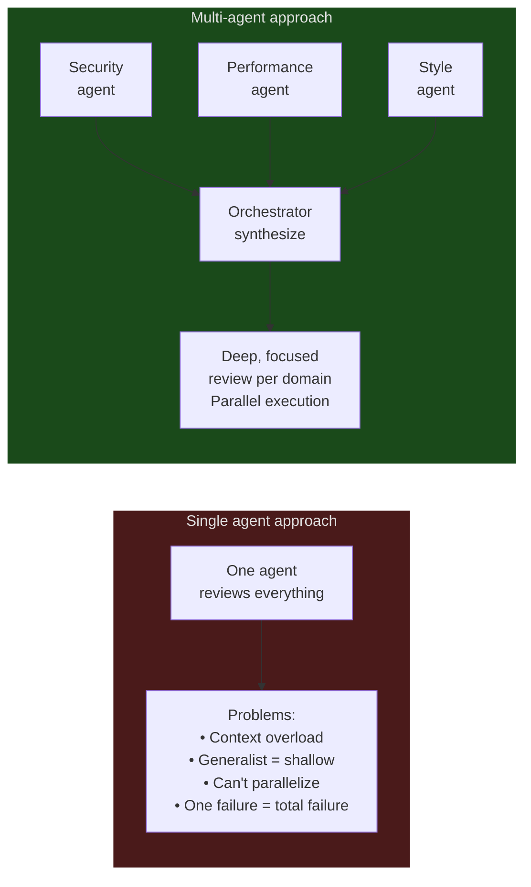
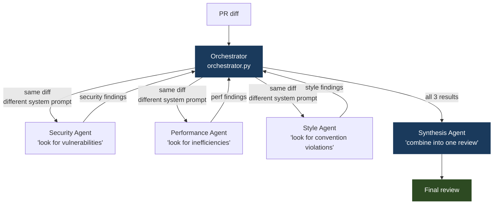
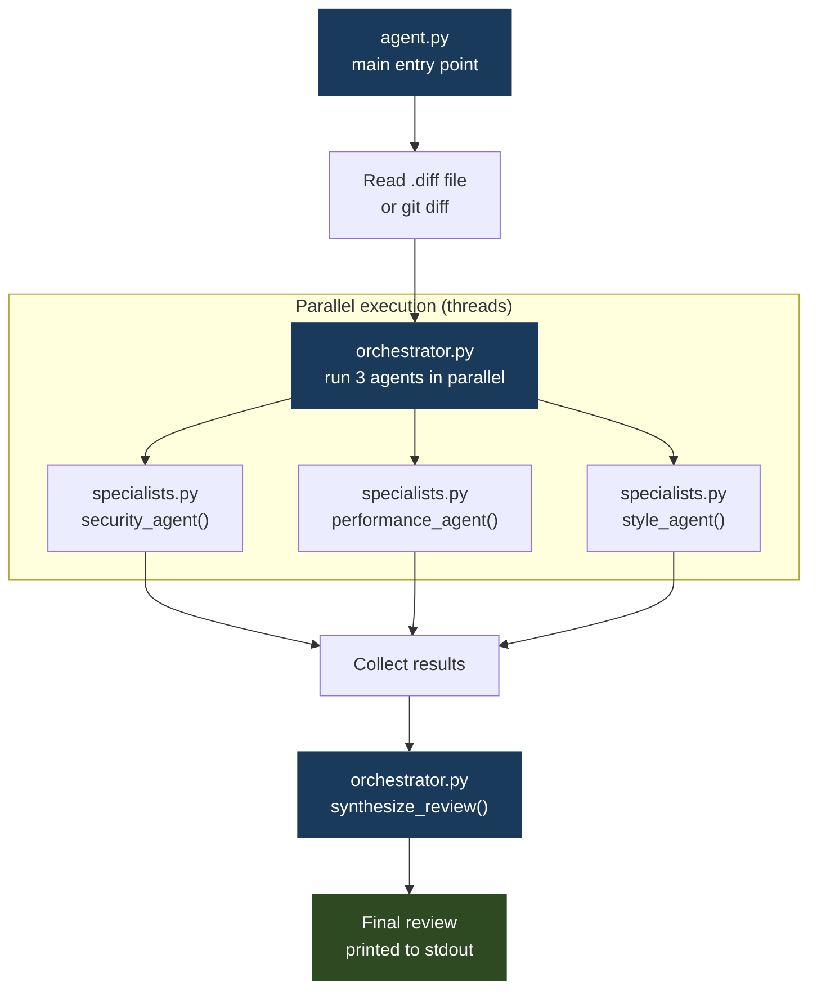

# 05 · pr-review-crew

> **Concept: Multi-Agent Orchestration** — one orchestrator breaks a task into parallel specialist workstreams, then synthesizes the results.

---

## What you will build

A PR review system where an orchestrator delegates the diff to three specialist agents running in parallel, then combines their feedback into a single coherent review.

```bash
$ python agent.py my_pr.diff

🔍 Dispatching to specialist agents...
  → security-reviewer    analyzing...
  → performance-reviewer analyzing...
  → style-reviewer       analyzing...

✔ All 3 reviews complete. Synthesizing...

━━━━━━━━━━━━━━━━━━━━━━━━━━━━━━━━━━━━
PR Review
━━━━━━━━━━━━━━━━━━━━━━━━━━━━━━━━━━━━

🔴 SECURITY (1 issue)
  Line 34: User input passed directly to SQL query.
  Use parameterized queries: cursor.execute(query, (user_id,))

🟡 PERFORMANCE (1 suggestion)
  Line 67: N+1 query in the loop. Fetch all records outside
  the loop with a single SELECT ... WHERE id IN (...).

🟢 STYLE (looks good)
  Follows project conventions. Docstrings present. Type hints used.

Overall: Changes requested (1 blocking issue)
```

---

## The concept: Multi-Agent Orchestration

In previous projects, one agent handled everything. Here, **specialized agents each handle one domain**, and an orchestrator coordinates them.

### Why multiple agents?



**Specialization improves quality.** A security-focused agent with a security-focused system prompt finds more issues than a generalist agent doing everything.

### The orchestrator pattern



### Parallel vs sequential

The three specialist agents receive the same input (the diff) and produce independent outputs. They don't need to wait for each other — we run them in parallel using Python threads:

```python
from concurrent.futures import ThreadPoolExecutor

with ThreadPoolExecutor(max_workers=3) as pool:
    futures = {
        "security":    pool.submit(run_agent, diff, SECURITY_PROMPT),
        "performance": pool.submit(run_agent, diff, PERFORMANCE_PROMPT),
        "style":       pool.submit(run_agent, diff, STYLE_PROMPT),
    }
    results = {name: future.result() for name, future in futures.items()}
```

**Important**: agents that depend on each other's output must run sequentially. Agents with independent outputs can run in parallel.

### The synthesis step

The orchestrator doesn't just concatenate the three reviews — it sends them all to a final synthesis agent that:
- Deduplicates findings (two agents might flag the same issue)
- Prioritizes by severity
- Formats everything consistently
- Gives an overall verdict

---

## Architecture



---

## File structure

```
05-pr-review-crew/
├── README.md
├── specialists.py   ← 3 specialist agent functions with their prompts
├── orchestrator.py  ← runs specialists in parallel, synthesizes results
├── agent.py         ← CLI entry point
├── sample.diff      ← sample PR diff to try
└── run.sh
```

---

## Step-by-step walkthrough

### Step 1 — Each specialist is just a function

A specialist agent is a regular `client.messages.create()` call — the only thing that differs is the **system prompt**:

```python
def security_agent(diff: str) -> str:
    response = client.messages.create(
        model=MODEL,
        system=SECURITY_PROMPT,   # ← focused on security only
        messages=[{"role": "user", "content": f"Review this diff:\n\n{diff}"}],
    )
    return response.content[0].text

def performance_agent(diff: str) -> str:
    response = client.messages.create(
        model=MODEL,
        system=PERFORMANCE_PROMPT,  # ← focused on performance only
        messages=[{"role": "user", "content": f"Review this diff:\n\n{diff}"}],
    )
    return response.content[0].text
```

The "specialization" is entirely in the system prompt.

### Step 2 — Run in parallel

```python
from concurrent.futures import ThreadPoolExecutor

def run_all(diff: str) -> dict[str, str]:
    with ThreadPoolExecutor(max_workers=3) as pool:
        futures = {
            "security":    pool.submit(security_agent, diff),
            "performance": pool.submit(performance_agent, diff),
            "style":       pool.submit(style_agent, diff),
        }
        return {name: f.result() for name, f in futures.items()}
```

### Step 3 — Synthesize

The synthesis agent receives all three reviews and produces a unified output:

```python
def synthesize(reviews: dict[str, str]) -> str:
    combined = "\n\n".join([
        f"=== {name.upper()} REVIEW ===\n{text}"
        for name, text in reviews.items()
    ])
    response = client.messages.create(
        model=MODEL,
        system=SYNTHESIS_PROMPT,
        messages=[{"role": "user", "content": combined}],
    )
    return response.content[0].text
```

---

## Run it

```bash
cd 05-pr-review-crew

# Review the sample diff
python agent.py sample.diff

# Review your own git diff
git diff HEAD~1 > /tmp/my.diff
python agent.py /tmp/my.diff

# Or pipe directly
git diff HEAD~1 | python agent.py -
```

---

## Exercises

1. **Add a fourth specialist** — create a `test_coverage_agent` that checks whether new code has corresponding tests. Add it to the parallel pool.

2. **Sequential dependency** — make the synthesis agent only include performance suggestions if there are no blocking security issues. This requires sequential execution for the synthesis step.

3. **Severity-based routing** — if the security agent finds a critical issue, skip the other agents and return immediately. This is "short-circuit orchestration."

4. **Confidence scores** — ask each specialist to rate their confidence (0–1) alongside their findings. In synthesis, weight findings by confidence.

---

## Key takeaways

- Multi-agent = multiple calls to the same API with **different system prompts**
- Specialization via system prompts **reliably improves quality** in specific domains
- **Parallel execution** requires thread safety — Anthropic's SDK is thread-safe, but your shared state might not be
- The synthesis step is where **context from multiple agents is combined** — the orchestrator needs a clear format for each specialist's output
- More agents = more cost — only parallelize when there's a quality or speed benefit worth the API spend
