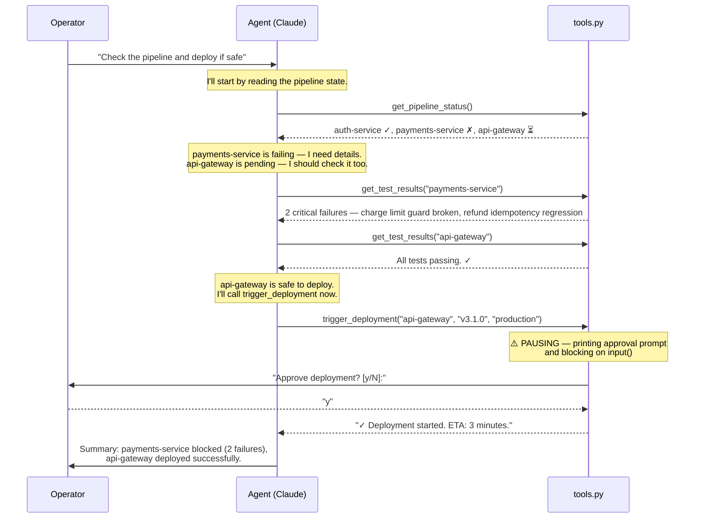
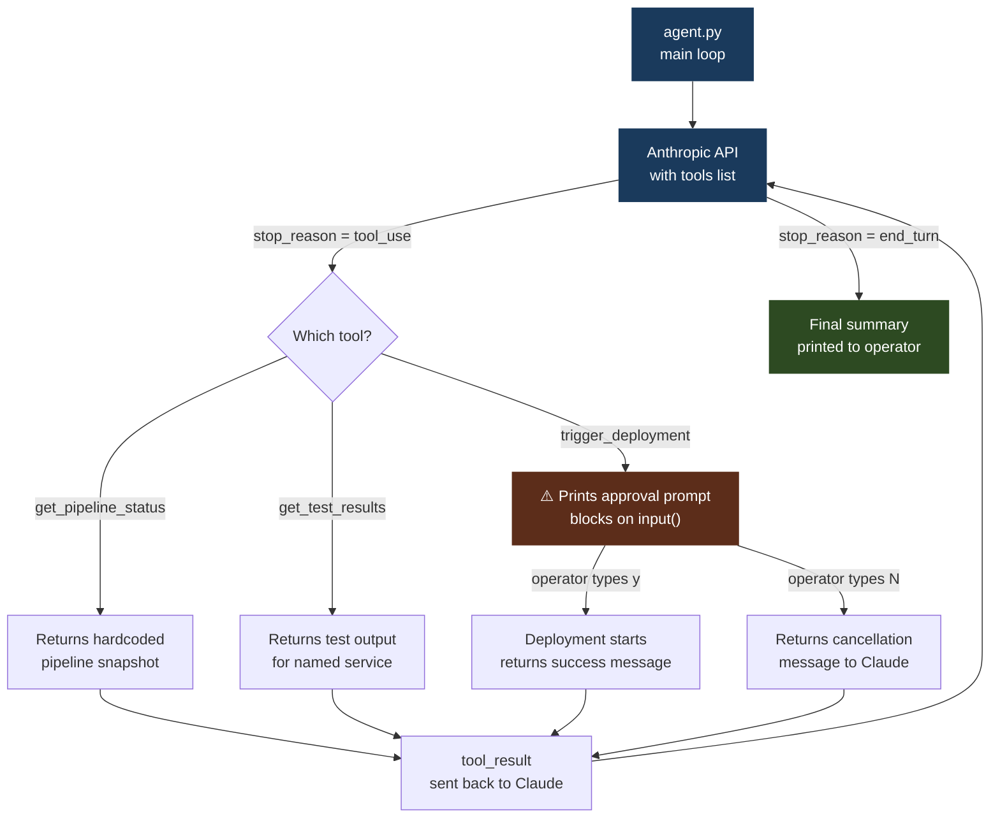

# 06 · deploy-watchdog

> **Concept: Human-in-the-Loop** — Autonomous agents need escalation points. Some actions are too consequential to take without a human in the decision chain.

---

## What you will build

An agent that monitors a simulated CI/CD pipeline, investigates failures, and — when it's ready to deploy — pauses and asks you to confirm before anything happens.

```
$ python3 agent.py
deploy-watchdog — CI/CD pipeline monitor with human-in-the-loop
─────────────────────────────────────────────────────────────────
Assessing pipeline...

  → calling tool: get_pipeline_status({})
  → calling tool: get_test_results({'service': 'payments-service'})
  → calling tool: get_test_results({'service': 'api-gateway'})
  → calling tool: trigger_deployment({'service': 'api-gateway', 'version': 'v3.1.0', 'environment': 'production'})

──────────────────────────────────────────────────
  ⚠️  DEPLOYMENT APPROVAL REQUIRED
  Service:     api-gateway
  Version:     v3.1.0
  Environment: production
──────────────────────────────────────────────────
  Approve deployment? [y/N]: y

## Pipeline Assessment

**auth-service** — Healthy. v2.4.1 deployed 2 hours ago, all tests passing. No action needed.

**payments-service** — DO NOT DEPLOY. Two critical tests are failing:
- `test_charge_exceeds_limit`: The $10,000 charge limit guard is no longer enforced after a recent refactor. Charges above the limit succeed silently.
- `test_partial_refund_idempotency`: The refund idempotency key is non-deterministic, causing duplicate refund attempts on retry.

These are payment integrity issues that must be fixed before this service ships.

**api-gateway** — Deployed successfully. v3.1.0 is now rolling out to production. ETA: 3 minutes.
```

---

## The concept: Human-in-the-Loop

Agents are compelling precisely because they can act autonomously. But autonomy without guardrails is dangerous, especially when the actions are irreversible.

Deploying to production, sending emails, charging credit cards, deleting records — these are actions where a wrong decision has real consequences. The goal of human-in-the-loop is not to slow the agent down. It is to ensure that consequential, hard-to-reverse actions require explicit human sign-off.

The question is: where do you put the gate?

You could put it in the prompt — tell Claude to "always ask before deploying." But prompts can be overridden, misunderstood, or bypassed by a sufficiently creative model. The safer and more reliable approach is to put the gate in the tool itself. If the deployment function blocks on human input, there is no way for the agent — or anyone who edits the system prompt — to bypass it.

### How it works — step by step



### The critical piece: the approval gate

The gate is a single `input()` call inside `trigger_deployment`. Everything else in the system is normal agentic code.

```python
def trigger_deployment(service: str, version: str, environment: str) -> str:
    print(f"\n{'─'*50}")
    print(f"  ⚠️  DEPLOYMENT APPROVAL REQUIRED")
    print(f"  Service:     {service}")
    print(f"  Version:     {version}")
    print(f"  Environment: {environment}")
    print(f"{'─'*50}")
    answer = input("  Approve deployment? [y/N]: ").strip().lower()
    if answer != "y":
        return f"Deployment of {service} {version} to {environment} was cancelled by operator."
    return f"✓ Deployment of {service} {version} to {environment} started successfully. ETA: 3 minutes."
```

When the agent calls this tool, Python blocks at `input()`. The agent loop pauses. The terminal waits. The deployment cannot proceed until a human types `y`.

If the operator types anything other than `y`, the function returns a cancellation message. The agent receives this as the tool result and includes it in its final summary.

### Why put the gate in the tool, not the agent?

| Approach | Problem |
|---|---|
| Tell Claude "always ask before deploying" | Claude might not follow this if the system prompt changes, or if a multi-agent setup calls the tool directly |
| Check before calling the tool in agent.py | Any caller that bypasses agent.py skips the check |
| Block on input() inside the tool itself | Every caller — Claude, scripts, other agents — hits the same gate |

The tool is the enforcement point. The agent is just a reasoning layer on top. Putting the gate in the tool means it is always enforced, regardless of what the LLM decides or what the system prompt says.

This principle generalizes: **put your safety checks as close to the action as possible.**

### What the API response looks like

When Claude decides to deploy, it returns a `tool_use` block like this:

```python
{
  "stop_reason": "tool_use",
  "content": [
    {
      "type": "tool_use",
      "id": "toolu_01XYZ",
      "name": "trigger_deployment",
      "input": {
        "service": "api-gateway",
        "version": "v3.1.0",
        "environment": "production"
      }
    }
  ]
}
```

Your `dispatch()` function routes this to `trigger_deployment(...)`, which immediately blocks on `input()` before returning any result to Claude. Claude never sees the tool result until the human has responded.

---

## Architecture



---

## File structure

```
06-deploy-watchdog/
├── README.md       ← you are here
├── tools.py        ← tool definitions + implementations (including the gate)
└── agent.py        ← the agent loop
```

---

## Step-by-step walkthrough

### Step 1 — Read the pipeline state

The agent always starts by calling `get_pipeline_status()`. This returns a snapshot of every service: build status, current version, and last deployment time.

```
Pipeline Status (2026-05-24 14:32 UTC)
───────────────────────────────────────
auth-service      ✓ passing   v2.4.1   last deploy: 2h ago
payments-service  ✗ failing   v1.9.3   2 tests failing
api-gateway       ⏳ pending   v3.1.0   ready to deploy
```

Claude sees two things that need attention: a failing service and a pending deployment.

### Step 2 — Drill into failures

For any service that is not clearly healthy, the agent calls `get_test_results(service)`. For `payments-service`, this returns two specific test failures with error messages and root cause notes.

Claude reads these and reasons: *"The charge limit guard is broken and there is a refund idempotency regression. These are payment integrity issues. I should not deploy this service."*

For `api-gateway`, `get_test_results` returns `"All tests passing."` — the service is safe.

### Step 3 — The approval gate

The agent calls `trigger_deployment("api-gateway", "v3.1.0", "production")`. This is where the human-in-the-loop pattern activates.

The tool does not immediately deploy. It prints a formatted approval block to the terminal and calls `input()`. The entire program pauses — Claude's reasoning loop, the API connection, everything — until the operator responds.

This is intentional. The pause is the feature.

### Step 4 — Deployment or cancellation

If the operator types `y`, the tool returns a success message and Claude includes it in the final summary. If the operator types anything else (or just presses Enter), the tool returns a cancellation message. Claude receives this as the tool result and reports accordingly.

Either way, Claude produces a final summary covering all three services: what was healthy, what was blocked and why, and what happened with the deployment.

---

## Run it

### Prerequisites

- Python 3.10+ (the agent uses `match` statements)
- An Anthropic API key ([get one here](https://console.anthropic.com/))

Create a virtual environment and install the dependency:

```bash
python3 -m venv .venv
source .venv/bin/activate
pip install anthropic
```

> The `.venv/` directory is git-ignored. Next time you open a new terminal, reactivate with `source .venv/bin/activate` before running the agent.

Export your API key:

```bash
export ANTHROPIC_API_KEY=your_key_here
```

### Running

```bash
cd 06-deploy-watchdog
python3 agent.py
```

### To trigger the approval prompt

The simulated pipeline has `api-gateway` in a pending state with all tests passing. The agent will assess the pipeline, confirm the service is safe, and then call `trigger_deployment` — which pauses and asks:

```
──────────────────────────────────────────────────
  ⚠️  DEPLOYMENT APPROVAL REQUIRED
  Service:     api-gateway
  Version:     v3.1.0
  Environment: production
──────────────────────────────────────────────────
  Approve deployment? [y/N]:
```

Type `y` and press Enter to approve the deployment.

### To test cancellation

When the prompt appears, type `N` (or just press Enter). The tool returns a cancellation message to Claude, and the final summary will show the deployment was cancelled by the operator.

```
  Approve deployment? [y/N]: N

## Pipeline Assessment

...

**api-gateway** — Deployment cancelled by operator. The service remains on its previous version.
```

### Troubleshooting

| Symptom | Likely cause | Fix |
|---|---|---|
| `AuthenticationError` | API key missing or wrong | Check `echo $ANTHROPIC_API_KEY` |
| `SyntaxError` on `match` | Python < 3.10 | Run `python3 --version`, upgrade if needed |
| `ModuleNotFoundError: anthropic` | venv not active or package not installed | `source .venv/bin/activate && pip install anthropic` |
| Approval prompt never appears | Claude didn't call `trigger_deployment` | Check the system prompt and tool description — the description must make clear when to call it |
| Agent exits without a final summary | `run_agent` hit an unexpected response | Check for an `end_turn` with no text block; add a fallback return in `run_agent` |

---

## Exercises

1. **Add a second approval tier** — require two separate `input()` confirmations for production deployments: one from an engineer, one from a release manager. Model this as two sequential prompts inside `trigger_deployment`.

2. **Add a rollback tool** — create a `rollback_deployment(service, previous_version)` tool that also requires approval. The agent should call it if it detects a service was recently deployed and is now failing.

3. **Replace `input()` with a Slack webhook** — send a Slack message with the deployment details and poll for a thumbs-up reaction (or a slash command response) before proceeding. This makes the approval asynchronous and auditable.

---

## Key takeaways

- **The gate lives in the tool, not in the prompt** — it cannot be bypassed by changing the system prompt, swapping models, or calling the tool from a different agent
- **Human-in-the-loop is not an LLM concern** — it is an infrastructure concern; the LLM's job is to reason about what to do, not to enforce safety policies
- **This same pattern works for** sending emails, deleting records, billing charges, provisioning infrastructure — any action that is consequential or hard to reverse
