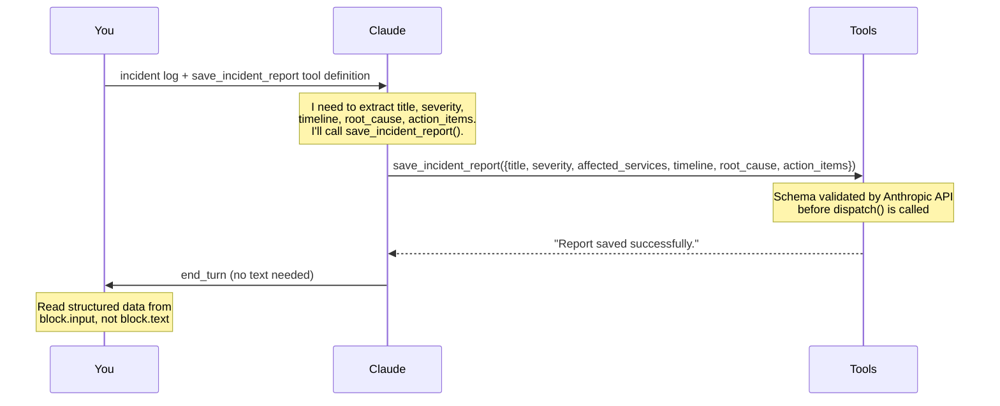
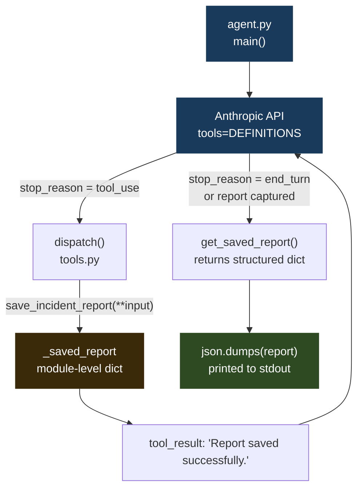

# 07 · incident-scribe

> **Concept: Structured Output** — use a tool's JSON schema as your output schema. Claude can't return malformed JSON — the schema rejects it before it reaches your code.

---

## What you will build

An agent that reads a raw incident log and produces a validated, structured post-incident report — guaranteed to have every required field in the exact shape you defined.

```bash
$ python3 agent.py
incident-scribe — structured incident report generator
──────────────────────────────────────────────────
Analyzing incident log...

  → calling tool: save_incident_report(['title', 'severity', 'affected_services', 'timeline', 'root_cause', 'action_items'])

──────────────────────────────────────────────────
Structured Incident Report
──────────────────────────────────────────────────
{
  "title": "payments-service outage due to DB connection pool exhaustion",
  "severity": "P2",
  "affected_services": [
    "payments-service"
  ],
  "timeline": [
    { "time": "14:03:22", "event": "ALERT: payments-service error rate exceeded 5% (currently 23%)" },
    { "time": "14:03:45", "event": "On-call engineer paged" },
    { "time": "14:05:11", "event": "payments-service pod restarts detected (3 in 2 minutes)" },
    { "time": "14:06:30", "event": "Investigation started — checking logs" },
    { "time": "14:08:15", "event": "Root cause found: DB connection pool exhausted (max=20, active=20)" },
    { "time": "14:09:00", "event": "Temporary fix applied: restarted payments-service pods" },
    { "time": "14:11:00", "event": "Error rate returned to 0.1% — service recovering" },
    { "time": "14:15:00", "event": "Root cause confirmed: flash sale email triggered 3x checkout surge" },
    { "time": "14:20:00", "event": "Permanent fix identified: increase max_connections to 100, add pooler" },
    { "time": "14:25:00", "event": "Incident resolved. Duration: 22 minutes. ~340 failed checkouts." }
  ],
  "root_cause": "A flash sale email sent at 14:02 caused a 3x surge in checkout requests that exhausted the payments-service database connection pool (max_connections=20).",
  "action_items": [
    "Increase payments-service DB max_connections from 20 to 100",
    "Deploy a connection pooler (e.g. PgBouncer) in front of the database",
    "Add alerting for connection pool saturation before it hits 100%",
    "Load-test the checkout flow against projected flash sale traffic before future campaigns",
    "Update the on-call runbook with connection pool troubleshooting steps"
  ],
  "generated_at": "2026-05-24T14:00:00.000000Z"
}
```

---

## The concept: Structured Output

### The problem with "return JSON"

The naive approach is to tell Claude in the system prompt: *"respond only with valid JSON in this format."* This is fragile. The LLM might:

- Wrap the JSON in markdown code fences (` ```json ... ``` `)
- Add an explanatory sentence before or after the JSON block
- Use slightly different field names (`root_cause` vs `rootCause` vs `cause`)
- Omit required fields when it has low confidence
- Include extra fields your schema doesn't expect

Every one of these requires defensive parsing code on your end — and you still can't guarantee the shape at the type level.

### The solution: tool schema as output schema

Instead of asking for JSON in prose, you define a tool whose `input_schema` is exactly the object shape you want. Then you instruct Claude to call it.

Now:

| Problem | What happens instead |
|---|---|
| Missing required field | API returns a validation error before `dispatch()` runs |
| Wrong enum value (`"p2"` instead of `"P2"`) | Rejected at schema level |
| Extra unexpected fields | Silently ignored by schema |
| Markdown fences around the output | Impossible — tool calls are structured, not text |
| Explanatory prose mixed in | Irrelevant — you read `block.input`, not `block.text` |

The tool call **is** the structured output. You never parse text.

### How it works — step by step



Claude never reaches `dispatch()` with a malformed payload — the API validates the tool input against the schema first.

### The critical piece: the schema is the contract

Here is the `input_schema` from `tools.py`. Every field Claude fills in must conform to this shape:

```python
"input_schema": {
    "type": "object",
    "properties": {
        "title": {
            "type": "string",
            "description": "Short descriptive title for the incident (under 60 chars)",
        },
        "severity": {
            "type": "string",
            "enum": ["P1", "P2", "P3", "P4"],   # ← only these values accepted
            "description": "P1=critical/outage, P2=major degradation, P3=minor, P4=informational",
        },
        "timeline": {
            "type": "array",
            "items": {
                "type": "object",
                "properties": {
                    "time": {"type": "string"},
                    "event": {"type": "string"},
                },
                "required": ["time", "event"],  # ← nested required fields
            },
        },
        # ... more fields
    },
    "required": ["title", "severity", "affected_services", "timeline", "root_cause", "action_items"],
}
```

The `required` array and `enum` constraints are enforced by the API, not by your code.

### Comparing approaches

| Approach | Reliability | Schema enforcement | Parsing code needed |
|---|---|---|---|
| "Return JSON" in system prompt | Fragile | None | Yes — strip fences, handle prose |
| `response_format` (OpenAI-style) | Medium | Partial | Sometimes |
| Tool schema (this approach) | High | Full JSON Schema | No — read `block.input` directly |

---

## Architecture



The agent loop ends as soon as `get_saved_report()` returns a non-empty dict. Claude doesn't need to reply with text — the tool call was the entire output.

---

## File structure

```
07-incident-scribe/
├── README.md       ← you are here
├── tools.py        ← tool definition + save/retrieve logic
└── agent.py        ← agent loop (captures output from tool call)
```

---

## Step-by-step walkthrough

### Step 1 — Define the output schema as a tool

Open `tools.py`. The tool definition has the exact same structure as every other tool in this series — but here, its **only purpose is to define the output shape**:

```python
DEFINITIONS = [
    {
        "name": "save_incident_report",
        "description": "Save the structured incident report. This is the ONLY way to submit your findings.",
        "input_schema": {
            "type": "object",
            "properties": {
                "title":             {"type": "string"},
                "severity":          {"type": "string", "enum": ["P1", "P2", "P3", "P4"]},
                "affected_services": {"type": "array", "items": {"type": "string"}},
                "timeline":          {"type": "array", "items": { ... }},
                "root_cause":        {"type": "string"},
                "action_items":      {"type": "array", "items": {"type": "string"}},
            },
            "required": ["title", "severity", "affected_services", "timeline", "root_cause", "action_items"],
        },
    },
]
```

The function `save_incident_report()` itself just stores the data in a module-level dict — no side effects, no network calls:

```python
_saved_report: dict = {}

def save_incident_report(title, severity, affected_services, timeline, root_cause, action_items):
    global _saved_report
    _saved_report = {
        "title": title,
        "severity": severity,
        # ...
        "generated_at": datetime.utcnow().isoformat() + "Z",
    }
    return "Report saved successfully."
```

### Step 2 — Force the tool call via system prompt

In `agent.py`, the system prompt tells Claude it **must** call the tool. This is the "force tool call" pattern:

```python
SYSTEM_PROMPT = """You are an incident response engineer creating post-incident reports.

Analyze the incident log and call save_incident_report with your findings.
You MUST call save_incident_report — do not write the report as text.
..."""
```

Without this instruction, Claude might write a nicely formatted Markdown report instead of calling the tool. The system prompt closes that door.

> **Note:** You can also use the `tool_choice` API parameter to force a specific tool call without relying on the system prompt. Both approaches work; the system prompt approach is more portable.

### Step 3 — Capture data from block.input, not block.text

In the agent loop, when Claude calls the tool, you dispatch it and check whether the report was captured:

```python
if response.stop_reason == "tool_use":
    messages.append({"role": "assistant", "content": response.content})

    tool_results = []
    for block in response.content:
        if block.type == "tool_use":
            result = dispatch(block.name, block.input)
            tool_results.append({
                "type": "tool_result",
                "tool_use_id": block.id,
                "content": result,
            })

    messages.append({"role": "user", "content": tool_results})

    # Check if the report was saved — if so, we're done
    report = get_saved_report()
    if report:
        return report          # ← structured dict, not text
```

`block.input` is already a Python dict. You never call `json.loads()`. You never strip markdown. You just use the data.

### Step 4 — The report is already structured

Back in `main()`, the return value of `run_agent()` is the dict that `save_incident_report()` stored. It has every required field, validated against the schema, ready to serialize or forward to downstream systems:

```python
report = run_agent(incident_log)

if report:
    print(json.dumps(report, indent=2))
    # Or: insert into a database, post to Slack, open a JIRA ticket, etc.
```

---

## Run it

### Prerequisites

- Python 3.10+ (the agent uses `match` statements)
- An Anthropic API key ([get one here](https://console.anthropic.com/))

Create a virtual environment and install the dependency:

```bash
python3 -m venv .venv
source .venv/bin/activate
pip install anthropic
```

> The `.venv/` directory is git-ignored. Next time you open a new terminal, reactivate with `source .venv/bin/activate` before running the agent.

Export your API key:

```bash
export ANTHROPIC_API_KEY=your_key_here
```

### Run the agent

```bash
cd 07-incident-scribe
python3 agent.py
```

The agent will:
1. Feed the hardcoded incident log to Claude
2. Claude calls `save_incident_report(...)` with a fully structured payload
3. The structured report is printed as formatted JSON

### Troubleshooting

| Symptom | Likely cause | Fix |
|---|---|---|
| `AuthenticationError` | API key missing or wrong | Check `echo $ANTHROPIC_API_KEY` |
| `SyntaxError` on `match` | Python < 3.10 | Run `python3 --version`, upgrade if needed |
| `Warning: agent responded with text` | System prompt not strong enough | Check `SYSTEM_PROMPT` in `agent.py` |
| `ModuleNotFoundError: anthropic` | venv not active or package not installed | `source .venv/bin/activate && pip install anthropic` |
| Empty report returned | Claude ended turn without tool call | The system prompt fallback prints a warning; check model version |

---

## Exercises

1. **Add an `on_call_engineer` field** — add a new string property to `input_schema` and to the `required` list in `tools.py`. Rerun the agent and observe that Claude automatically populates it (or leaves it blank if the log doesn't mention a name). Notice you didn't change `agent.py` at all — the schema change propagates automatically.

2. **Change severity from enum to integer** — replace the `enum: ["P1","P2","P3","P4"]` with `type: integer, minimum: 1, maximum: 4`. Rerun. Observe how Claude adapts its output to the new constraint without any prompt change.

3. **Pipe real PagerDuty or Slack export text** — instead of the hardcoded `incident_log` string in `main()`, read from `sys.stdin` or accept a file path as a CLI argument. Paste in a real post-mortem or Slack thread and see the structured report generated from messy real-world text.

---

## Key takeaways

- **`tool_use` is a structured output mechanism**, not just an action mechanism. You can use it purely to extract data without any side effects.
- **The schema validates before your code runs** — you get a guarantee, not a hope. Required fields are present. Enum values are valid. Nested objects have their required keys.
- **"Force tool call" pattern**: a system prompt that says "you MUST call X" reliably redirects Claude from free-text responses to structured tool calls.
- **Read `block.input` for structured data, `block.text` for prose** — when you capture output from a tool call, the data is already a Python dict. No JSON parsing, no markdown stripping.
- **The tool description matters** — "This is the ONLY way to submit your findings" signals to Claude that the tool call is the terminal action, not an intermediate step.
