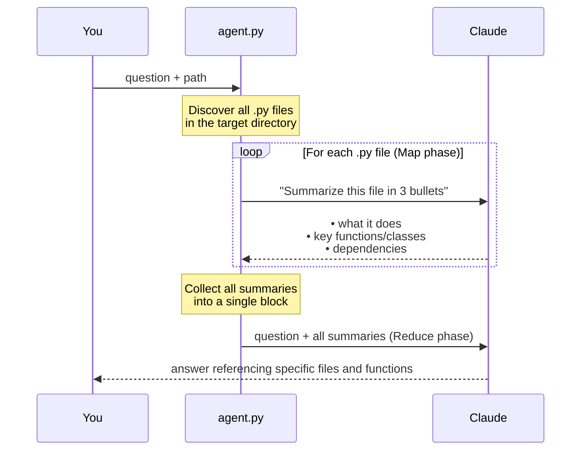
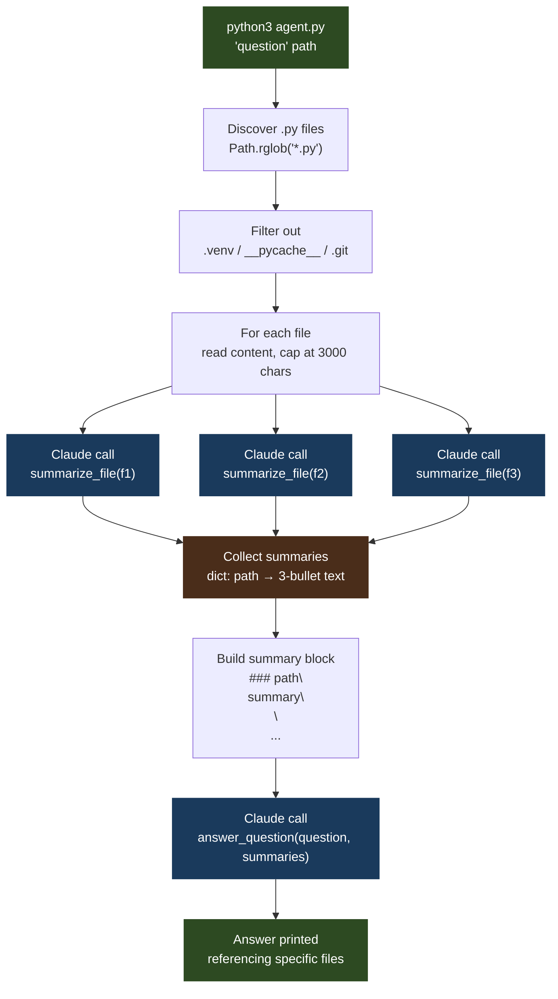

# 08 · codebase-navigator

> **Concept: Hierarchical Summarization** — when a codebase is too large for one context window, summarize each file first (map), then synthesize summaries to answer (reduce).

---

## What you will build

An agent that answers questions about any Python codebase — even one too large to fit in a single context window — by applying the map-reduce pattern across files.

```bash
$ python3 agent.py 'What does this codebase do?' ../03-shell-pilot

codebase-navigator — hierarchical summarization
──────────────────────────────────────────────────
Question: What does this codebase do?
Path:     ../03-shell-pilot

Found 6 Python file(s). Summarizing...

  → summarizing ../03-shell-pilot/agent.py
  → summarizing ../03-shell-pilot/tools.py
  → summarizing ../03-shell-pilot/memory.py
  → summarizing ../03-shell-pilot/utils.py
  → summarizing ../03-shell-pilot/config.py
  → summarizing ../03-shell-pilot/run_tests.py

Synthesizing 6 summaries to answer your question...

──────────────────────────────────────────────────
This codebase implements a ReAct-loop shell agent. The entry point is
`agent.py`, which drives a multi-step reasoning loop: it sends the user's
task to Claude, receives tool calls, executes them via `tools.py`, and feeds
results back until Claude produces a final answer. `tools.py` provides three
tools — `run_command`, `read_file`, and `write_file` — each with safety
guardrails defined in `config.py`. Utility helpers in `utils.py` handle
formatting and truncation of long tool outputs. `run_tests.py` contains
integration tests that exercise the full loop against a mock Claude client.
```

---

## The concept: Hierarchical Summarization

### The problem: context windows have limits

A real production codebase — 50 files, 500 lines each — can't fit in a single Claude call. Even if it could, flooding the context with thousands of lines of irrelevant code degrades answer quality. Claude has to sift through everything to find what matters.

The naive approaches fail in opposite ways:

| Approach | Problem |
|---|---|
| Send all code in one call | Exceeds context window; expensive; noisy |
| Send one file at a time | No synthesis across files; misses cross-file relationships |

### The solution: Map-Reduce

Map-Reduce is a pattern from distributed computing repurposed for LLMs. Instead of processing one giant input, you break work into small independent units, process each, then combine the results.

```
Map:    file₁ → summary₁
        file₂ → summary₂       (many small, cheap, parallel-able calls)
        file₃ → summary₃
           ↓
Reduce: summary₁ + summary₂ + summary₃ → answer    (one final synthesis call)
```

**The key insight:** summaries are dramatically smaller than source code. Fifty files at 500 lines each is 25,000 lines of code. Summarized to 3 bullets each: roughly 150 lines of text. That fits easily in a single Claude call — and it contains the semantics needed to answer most questions.

### How it works — step by step



### The critical piece: two functions, two phases

**Phase 1 — `summarize_file()`** (called once per file):

```python
def summarize_file(file_path: str, content: str) -> str:
    response = client.messages.create(
        model=MODEL,
        max_tokens=256,                        # small — just 3 bullets
        system="You are a code summarizer. Be brief and precise.",
        messages=[{
            "role": "user",
            "content": (
                f"Summarize this file in exactly 3 bullet points. "
                f"Focus on: what it does, key functions/classes, dependencies.\n\n"
                f"File: {file_path}\n\n{content}"
            ),
        }],
    )
    return response.content[0].text
```

Each call is cheap: `max_tokens=256` means a short output, and `content[:3000]` caps the input per file. You pay a small, bounded cost per file.

**Phase 2 — `answer_question()`** (called once for everything):

```python
def answer_question(question: str, summaries: dict[str, str]) -> str:
    summary_block = "\n\n".join(
        f"### {path}\n{summary}" for path, summary in summaries.items()
    )
    response = client.messages.create(
        model=MODEL,
        max_tokens=1024,
        system=(
            "You are a codebase expert. Answer questions using the file summaries provided. "
            "Be specific — reference file names and function names in your answer. "
            "If you can't answer from the summaries, say so."
        ),
        messages=[{
            "role": "user",
            "content": f"Question: {question}\n\nCodebase summaries:\n\n{summary_block}",
        }],
    )
    return response.content[0].text
```

This call sees compressed context — only the summaries — and produces a specific, file-referenced answer.

### When to use this pattern

| Situation | Best approach |
|---|---|
| Codebase fits in one context window (< ~10 files) | Single call with all code |
| Codebase too large for one call | Map-Reduce (this project) |
| Need to navigate and read specific files interactively | Agent with `read_file` tool (project 03) |
| Domain docs, not source code | RAG with embeddings (project 02) |
| Files need cross-referencing during summarization | Hierarchical summarization with a dependency pass |

---

## Architecture



---

## File structure

```
08-codebase-navigator/
├── README.md    ← you are here
└── agent.py     ← map-reduce implementation (no tools.py needed)
```

This project has no `tools.py`. Unlike the other projects in this series, the agent does not use Claude's tool-use API at all. It makes direct `client.messages.create` calls — one per file in Phase 1, one final call in Phase 2. The structure comes from the two-phase logic, not from a tool registry.

---

## Step-by-step walkthrough

### Step 1 — Discover files

```python
root = Path(path)
files = sorted(root.rglob("*.py"))

files = [
    f for f in files
    if not any(part.startswith((".venv", "__pycache__", ".git")) for part in f.parts)
]
```

`Path.rglob("*.py")` walks the entire directory tree recursively. The filter strips out generated files (`.venv`, `__pycache__`) that would waste API calls on non-meaningful content. Files are sorted so output is deterministic.

### Step 2 — Map: summarize each file

```python
summaries = {}
for f in files:
    content = f.read_text(encoding="utf-8", errors="ignore")
    if not content.strip():
        continue
    print(f"  → summarizing {f}")
    summaries[str(f)] = summarize_file(str(f), content[:3000])
```

The `content[:3000]` cap is a cost-control measure. Most of the semantically important information in a file (imports, class definitions, function signatures, docstrings) appears in the first 3000 characters. The exact threshold is tunable.

### Step 3 — Reduce: synthesize summaries

```python
print(f"\nSynthesizing {len(summaries)} summaries to answer your question...\n")
return answer_question(question, summaries)
```

All summaries are assembled into a single block and sent to Claude with the original question. Claude receives a compressed but semantically complete view of the entire codebase.

### Step 4 — Answer references real file names

The system prompt explicitly instructs Claude to be specific — reference file names and function names. This means the answer is actionable: you can go directly to `agent.py → summarize_file()` rather than a vague "somewhere in the code."

---

## Run it

### Prerequisites

- Python 3.10+
- An Anthropic API key ([get one here](https://console.anthropic.com/))

Create a virtual environment and install the single dependency:

```bash
python3 -m venv .venv
source .venv/bin/activate
pip install anthropic
```

> The `.venv/` directory is git-ignored. Reactivate with `source .venv/bin/activate` whenever you open a new terminal.

Export your API key:

```bash
export ANTHROPIC_API_KEY=your_key_here
```

### Running

```bash
# Answer a question about the current directory
python3 agent.py 'What does this codebase do?'

# Point at another project in this series
python3 agent.py 'Where is error handling?' ../03-shell-pilot

# More useful questions
python3 agent.py 'List all entry points and what arguments they accept'
python3 agent.py 'What external dependencies are used?'
python3 agent.py 'Which files are most likely to have bugs?'
python3 agent.py 'How does data flow through this codebase?'
```

### What to expect

For a codebase with 6 files you will see:

```
Found 6 Python file(s). Summarizing...

  → summarizing agent.py
  → summarizing tools.py
  → summarizing memory.py
  → summarizing utils.py
  → summarizing config.py
  → summarizing run_tests.py

Synthesizing 6 summaries to answer your question...

──────────────────────────────────────────────────
[Answer that references specific file names and function names]
```

Each `→ summarizing` line corresponds to one Claude API call. The final synthesis is one more call. Total for a 6-file project: 7 API calls.

### Troubleshooting

| Symptom | Likely cause | Fix |
|---|---|---|
| `AuthenticationError` | API key missing or wrong | Check `echo $ANTHROPIC_API_KEY` |
| `No Python files found in .` | Wrong path, or path has only `.pyc` files | Check the path argument; try an absolute path |
| `SyntaxError` on `dict[str, str]` | Python < 3.9 | Run `python3 --version`, upgrade if needed |
| `ModuleNotFoundError: anthropic` | venv not active or package not installed | `source .venv/bin/activate && pip install anthropic` |
| Summaries are low quality | Files are very short or have no docstrings | Works best on files with at least a few named functions |
| Answer is vague | Summaries lost too much detail | Lower the `content[:3000]` cap or increase `max_tokens=256` in `summarize_file` |

---

## Exercises

1. **Add a `--max-files` flag** — modify `main()` to accept a `--max-files N` argument and slice `files[:N]` before the map phase. This gives you cost control when pointing at a large codebase. Print the cost estimate (N × ~$0.0003) before starting.

2. **Cache summaries to disk** — save summaries to a `.summaries.json` file keyed by `(file_path, mtime)`. On the next run, skip re-summarizing files that haven't changed. This makes the tool fast on large codebases after the first run.

3. **Add a third phase** — after producing the answer, make a third Claude call: "Based on your answer, which 1-3 files should I read in full for a more complete picture?" Then read those files and append their full content for a follow-up synthesis call.

---

## Key takeaways

- **Map-Reduce is a general LLM pattern**, not just a database concept — any problem too large for one call can be decomposed into map (many small calls) + reduce (one synthesis call)
- **Summaries compress information** — 500 lines of code becomes 3 bullets, losing noise but keeping signal; most questions can be answered from summaries alone
- **Cost scales with file count in Phase 1**, not codebase size — a 10,000-line file costs the same as a 100-line file thanks to the `content[:3000]` cap
- **The reduce step works** because summaries preserve the semantics needed for most structural questions — architecture, entry points, dependencies, data flow
- **No tool-use API needed** — this project shows that the tool-use pattern is not the only way to build agents; direct multi-call orchestration is sometimes cleaner
