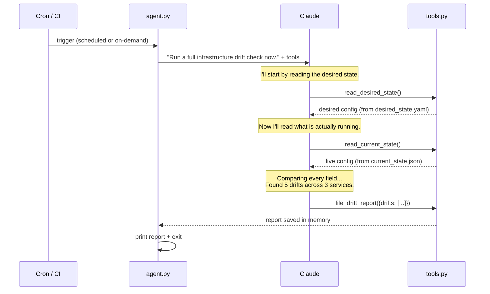
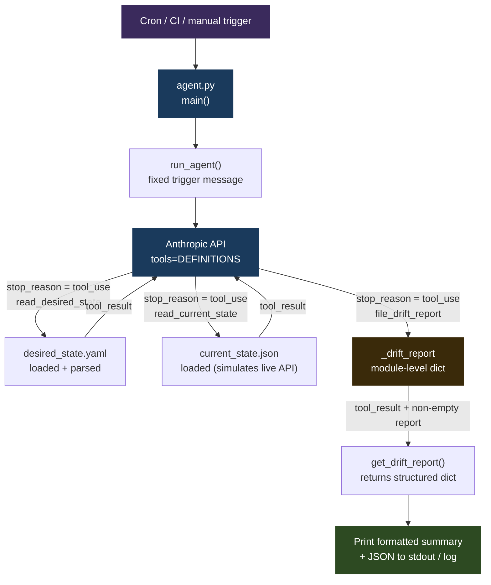

# 09 · config-drift-detector

> **Concept: Scheduled / Event-Driven Agents** — not all agents are interactive. This one wakes up, checks state, files a report, and exits — ready to be triggered by cron, CI, or a webhook.

---

## What you will build

An agent that compares your desired infrastructure configuration against what is actually running, then produces a structured drift report — without a human in the loop.

```bash
$ python3 agent.py
config-drift-detector — infrastructure drift check
──────────────────────────────────────────────────
Trigger: manual run (see run.sh for cron setup)

  → calling tool: read_desired_state({})
  → calling tool: read_current_state({})
  → calling tool: file_drift_report({'summary': '5 infrastructure drifts detected across 3 services and feature flags', 'drift_count': 5, 'drifts': [...]})

──────────────────────────────────────────────────
Summary: 5 infrastructure drifts detected across 3 services and feature flags
Total drifts: 5 (2 critical, 2 warnings)

Drifts found:
  🔴 payments-service.replicas: 3 → 2
  🔴 auth-service.image: auth-service:v1.4.2 → auth-service:v1.4.1
  🟡 payments-service.env.LOG_LEVEL: info → debug
  🟡 api-gateway.env.RATE_LIMIT: 1000 → 500
  🔵 feature_flags.beta_api: false → true

Recommendation: Immediately scale payments-service back to 3 replicas and roll auth-service forward to v1.4.2. Investigate why LOG_LEVEL and RATE_LIMIT were changed outside the desired state process. Review beta_api flag enablement.

Full report (JSON):
{
  "summary": "5 infrastructure drifts detected across 3 services and feature flags",
  "drift_count": 5,
  "drifts": [
    {
      "resource": "payments-service",
      "field": "replicas",
      "desired": "3",
      "actual": "2",
      "severity": "critical"
    },
    {
      "resource": "auth-service",
      "field": "image",
      "desired": "auth-service:v1.4.2",
      "actual": "auth-service:v1.4.1",
      "severity": "critical"
    },
    {
      "resource": "payments-service",
      "field": "env.LOG_LEVEL",
      "desired": "info",
      "actual": "debug",
      "severity": "warning"
    },
    {
      "resource": "api-gateway",
      "field": "env.RATE_LIMIT",
      "desired": "1000",
      "actual": "500",
      "severity": "warning"
    },
    {
      "resource": "feature_flags",
      "field": "beta_api",
      "desired": "false",
      "actual": "true",
      "severity": "info"
    }
  ],
  "recommendation": "Immediately scale payments-service back to 3 replicas and roll auth-service forward to v1.4.2. Investigate why LOG_LEVEL and RATE_LIMIT were changed outside the desired state process. Review beta_api flag enablement.",
  "generated_at": "2026-05-24T14:00:00.000000Z"
}
```

---

## The concept: Scheduled / Event-Driven Agents

### Interactive agents vs. scheduled agents

Every project in this series up to this point — git-narrator, shell-pilot, standup-bot — has had a human in the loop. A person asks a question. The agent reasons and acts. The person sees the response.

But many real-world agent use cases have no interactive user at all:

- **Drift detection** — wake up hourly, compare state, report differences
- **Nightly cost reports** — pull cloud billing data, summarize spend, post to Slack
- **Health checks that file tickets** — ping services, detect anomalies, open a JIRA issue
- **Post-deploy validation** — after a CI pipeline completes, verify the deployment looks healthy

In all of these, the agent is triggered by time or an event — not a human typing a message. It runs, does its job, and exits. Nobody is watching the terminal. The output goes to a log file, a Slack channel, a ticketing system, or an alerting pipeline.

### The key differences

| | Interactive agent | Scheduled agent |
|---|---|---|
| Trigger | Human message | Cron / webhook / CI |
| Output | Response to user | File / log / alert |
| Loop | Conversation history | Single run |
| Error handling | Ask the user | Retry / alert |
| System prompt | Sets tone and constraints | Replaces the user entirely |

The architecture is almost identical. The agent loop, tool dispatch, and Anthropic API calls are the same. What changes is the **entry point** and the **exit point** — who starts the run, and where the output goes.

### How it works — step by step



There is no human in this sequence. The trigger fires, the agent runs, the report is produced, and the process exits. The operator might check the log file later — or an alerting system might parse the JSON output and fire a PagerDuty alert if `drift_count > 0`.

### The critical piece: the agent has no user

Look at the system prompt in `agent.py`. It does not greet a user or ask for clarification. It describes a job and a process:

```python
SYSTEM_PROMPT = """You are an infrastructure reliability engineer running an automated drift check.

Your job:
1. Call read_desired_state to get the desired configuration
2. Call read_current_state to get what is actually running
3. Compare every field: replicas, image versions, env vars, feature flags
4. Call file_drift_report with all differences you find
..."""
```

And the trigger message in `main()` is fixed — it never changes, and no human types it:

```python
messages = [{"role": "user", "content": "Run a full infrastructure drift check now."}]
```

This is the **scheduled agent pattern in one line**: a hardcoded trigger message that fires the agent without any human involvement. The system prompt is the policy. The trigger message is the clock. The output is the artifact.

### Scheduling patterns

**Cron job** — run every hour, append output to a log file:

```bash
# crontab -e
0 * * * * cd /path/to/09-config-drift-detector && python3 agent.py >> drift.log 2>&1
```

**GitHub Actions** — run on a schedule or on every push to main:

```yaml
name: drift-check
on:
  schedule:
    - cron: "0 * * * *"   # every hour
  workflow_dispatch:        # also runnable manually from the Actions tab

jobs:
  drift:
    runs-on: ubuntu-latest
    steps:
      - uses: actions/checkout@v4
      - uses: actions/setup-python@v5
        with: { python-version: "3.11" }
      - run: pip install anthropic pyyaml
      - run: python3 09-config-drift-detector/agent.py
        env:
          ANTHROPIC_API_KEY: ${{ secrets.ANTHROPIC_API_KEY }}
```

**CI post-deploy step** — validate state immediately after a deployment completes:

```yaml
# GitLab CI / CD
post-deploy-drift-check:
  stage: verify
  script:
    - pip install anthropic pyyaml
    - python3 agent.py
  after_script:
    - "[ $CI_JOB_STATUS == 'failed' ] && curl -X POST $SLACK_WEBHOOK -d '{\"text\": \"Drift detected after deploy\"}'"
```

---

## Architecture



The agent loop exits as soon as `get_drift_report()` returns a non-empty dict — immediately after `file_drift_report` is called. It does not wait for `end_turn`. The report is the signal that the job is done.

---

## File structure

```
09-config-drift-detector/
├── README.md
├── agent.py             ← agent loop + main() entry point
├── tools.py             ← tool definitions + dispatch
├── desired_state.yaml   ← source of truth (what SHOULD be running)
├── current_state.json   ← simulated live state (has intentional drift)
└── run.sh               ← one-command runner with cron instructions
```

---

## Step-by-step walkthrough

### Step 1 — Define desired state (YAML)

Open `desired_state.yaml`. This is your source of truth — the canonical record of what should be running in production. In a real system, this would be your Helm values file, Terraform variables, or an infrastructure-as-code manifest.

```yaml
services:
  payments-service:
    replicas: 3
    image: payments-service:v2.1.0
    env:
      DB_POOL_SIZE: "20"
      LOG_LEVEL: info
    resources:
      cpu_limit: "500m"
      memory_limit: "512Mi"
```

Every field here is something the agent will check against the live state.

### Step 2 — Simulate live state (JSON with drift)

Open `current_state.json`. This simulates what you'd get back from `kubectl get deployment -o json` or a Terraform state query. It has five intentional drifts baked in:

| Drift | Type | Severity |
|---|---|---|
| `payments-service.replicas`: 3 → 2 | Scale-down | Critical |
| `auth-service.image`: v1.4.2 → v1.4.1 | Version rollback | Critical |
| `payments-service.env.LOG_LEVEL`: info → debug | Config change | Warning |
| `api-gateway.env.RATE_LIMIT`: 1000 → 500 | Config change | Warning |
| `feature_flags.beta_api`: false → true | Flag flip | Info |

These represent common real-world drift scenarios: a pod that crashed and came back with fewer replicas, an accidental rollback, a manual config change someone forgot to commit, and a feature flag enabled outside the normal release process.

### Step 3 — Agent compares, calls file_drift_report

The agent reads both files, reasons about every field, and calls `file_drift_report` with the full diff. The tool schema enforces the output shape — every drift item must have `resource`, `field`, `desired`, `actual`, and `severity`. The schema's `enum` constraint on `severity` means Claude cannot invent values outside `["critical", "warning", "info"]`.

The severity assessment logic is in the system prompt, not in code:

```
critical = service degradation risk (wrong replicas, wrong image version)
warning   = config mismatch that could cause issues (wrong env vars)
info      = minor differences (logging levels, non-critical flags)
```

Claude applies this rubric to each drift. A scale-down to fewer replicas is critical because it affects capacity. A debug log level is a warning because it can affect performance and expose sensitive data. A feature flag flip is info because it may be intentional.

### Step 4 — Report output

Back in `main()`, the report dict is formatted for human reading and also printed as JSON:

```python
for d in drifts:
    icon = "🔴" if d["severity"] == "critical" else "🟡" if d["severity"] == "warning" else "🔵"
    print(f"  {icon} {d['resource']}.{d['field']}: {d['desired']} → {d['actual']}")
```

The JSON output is what downstream systems consume. You could pipe it to `jq`, parse it in a CI step, or forward it to a ticketing system:

```bash
python3 agent.py | tail -n +20 | jq '.drifts[] | select(.severity == "critical")'
```

---

## Run it

### Prerequisites

- Python 3.10+ (the agent uses `match` statements)
- An Anthropic API key ([get one here](https://console.anthropic.com/))

Create a virtual environment and install dependencies:

```bash
python3 -m venv .venv
source .venv/bin/activate
pip install anthropic pyyaml
```

> PyYAML is optional. If it is not installed, `read_desired_state` falls back to returning the raw YAML string — Claude can still parse it. Install it for cleaner, JSON-normalized output.

> The `.venv/` directory is git-ignored. Next time you open a new terminal, reactivate with `source .venv/bin/activate` before running the agent.

Export your API key:

```bash
export ANTHROPIC_API_KEY=your_key_here
```

### Run the agent

```bash
cd 09-config-drift-detector
python3 agent.py
# or
bash run.sh
```

The agent will:
1. Call `read_desired_state` — loads `desired_state.yaml`
2. Call `read_current_state` — loads `current_state.json`
3. Call `file_drift_report` — structured report with all 5 drifts
4. Print the formatted summary and full JSON report

### Troubleshooting

| Symptom | Likely cause | Fix |
|---|---|---|
| `AuthenticationError` | API key missing or wrong | Check `echo $ANTHROPIC_API_KEY` |
| `SyntaxError` on `match` | Python < 3.10 | Run `python3 --version`, upgrade if needed |
| `ModuleNotFoundError: anthropic` | venv not active or package not installed | `source .venv/bin/activate && pip install anthropic` |
| `ModuleNotFoundError: yaml` | PyYAML not installed | `pip install pyyaml` or ignore — fallback is built in |
| Empty report returned | Claude ended turn without calling `file_drift_report` | Check system prompt; strengthen "you MUST call file_drift_report" |
| Fewer than 5 drifts reported | Model missed some fields | Add explicit field enumeration to the system prompt |

---

## Exercises

1. **Write the report to a timestamped file** — instead of printing to stdout, save to `drift_YYYY-MM-DD_HH-MM.json`. Accumulate a history of drift reports and detect which drifts are recurring vs. new.

2. **Add remediation commands** — extend the `file_drift_report` schema with a `remediation_commands` array. For each drift, have Claude suggest the exact command to fix it:
   - `kubectl scale deployment/payments-service --replicas=3`
   - `kubectl set image deployment/auth-service auth-service=auth-service:v1.4.2`

3. **Replace `current_state.json` with a real live query** — swap `read_current_state` to run `kubectl get deployment -o json` or `terraform show -json`. The agent loop, tool schema, and report format stay exactly the same. Only the data source changes.

4. **Add a Slack alert on critical drift** — after `main()` prints the report, check `len(critical) > 0` and send a POST to a Slack webhook. The agent becomes a monitoring system.

---

## Key takeaways

- **Agents don't need a human in the loop** — the system prompt IS the user. A hardcoded trigger message in `main()` replaces interactive input entirely.
- **Scheduled agents output to logs and files, not chat** — the same tool-use pattern from every previous project works unchanged; only the entry point and exit point differ.
- **The trigger can be anything** — cron, a CI pipeline step, a GitHub Actions schedule, a webhook from PagerDuty or Datadog. The agent doesn't know or care what started it.
- **Structured output (project 07) + scheduled trigger = automated reporting pipeline** — the `file_drift_report` schema guarantees every report has the same shape, making it trivially parseable by downstream systems.
- **The severity rubric lives in the system prompt** — changing what counts as critical vs. warning requires only a prompt edit, not a code change. The schema enforces the allowed values; the prompt defines the policy.
