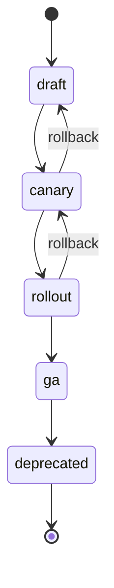
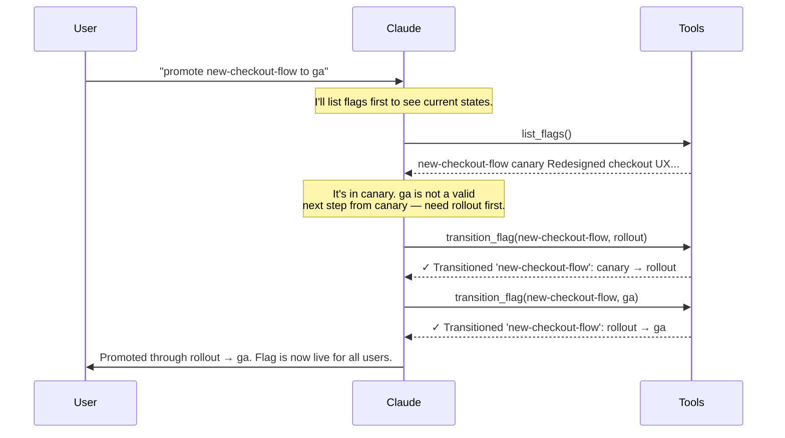
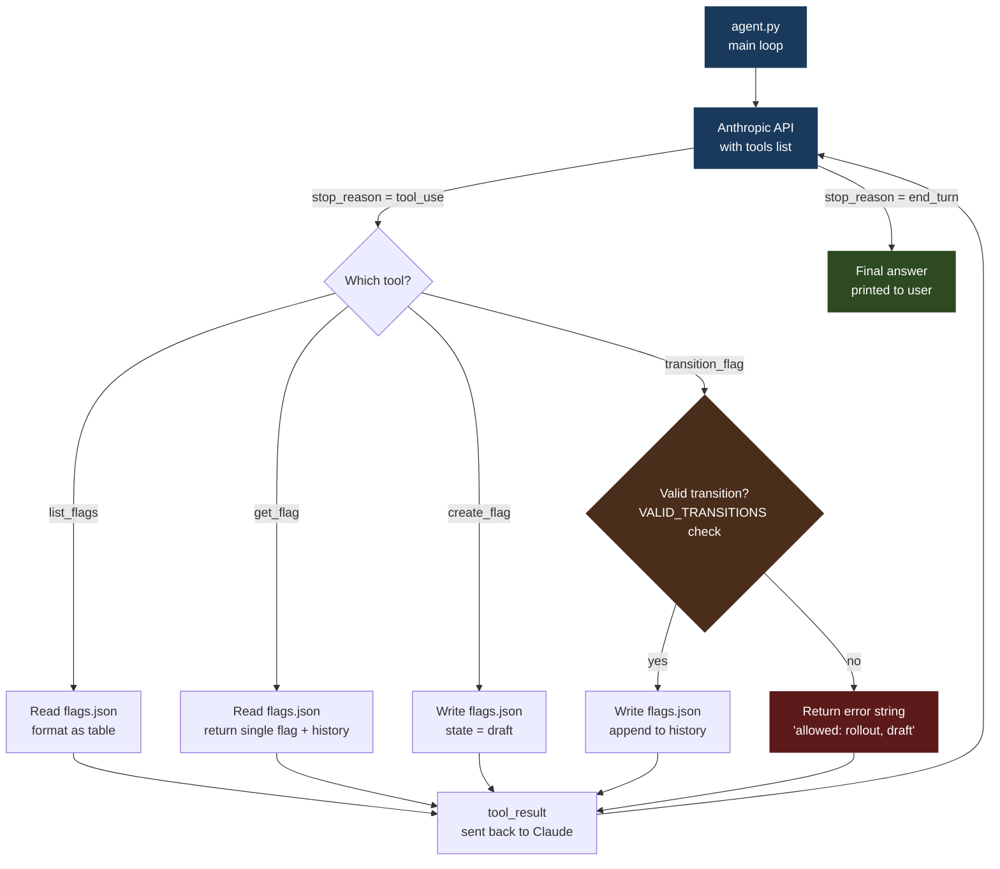

# 10 · feature-flag-manager

> **Concept: State Machine Agents** — the agent interprets your intent; the state machine enforces what's valid. Claude can request any transition, but invalid ones fail with a clear error — and Claude recovers.

---

## What you will build

An agent that manages the full lifecycle of feature flags — from draft through canary, rollout, GA, and deprecation — using a strict state machine baked into the tools, not the prompt.

```bash
$ python3 agent.py 'promote new-checkout-flow to rollout'

feature-flag-manager — state machine agent
─────────────────────────────────────────────
Command: promote new-checkout-flow to rollout

  → calling tool: list_flags({})
  → calling tool: get_flag({'name': 'new-checkout-flow'})
  → calling tool: transition_flag({'name': 'new-checkout-flow', 'to_state': 'rollout', 'reason': 'Promoting from canary to rollout'})

Promoted **new-checkout-flow** from `canary` to `rollout`.
The flag is now in rollout state and will be served to a wider audience.
```

```bash
$ python3 agent.py 'try to jump new-checkout-flow straight to deprecated'

feature-flag-manager — state machine agent
─────────────────────────────────────────────
Command: try to jump new-checkout-flow straight to deprecated

  → calling tool: list_flags({})
  → calling tool: get_flag({'name': 'new-checkout-flow'})
  → calling tool: transition_flag({'name': 'new-checkout-flow', 'to_state': 'deprecated'})

The tool returned: Error: invalid transition 'rollout' → 'deprecated'.
From 'rollout', allowed: ga, canary

  → calling tool: transition_flag({'name': 'new-checkout-flow', 'to_state': 'ga', 'reason': 'Stepping through required states toward deprecated'})
  → calling tool: transition_flag({'name': 'new-checkout-flow', 'to_state': 'deprecated', 'reason': 'Completing deprecation as requested'})

I couldn't jump directly to `deprecated` — the state machine rejected it with:
  "invalid transition 'rollout' → 'deprecated'. From 'rollout', allowed: ga, canary"

So I stepped through the required intermediate states: rollout → ga → deprecated.
**new-checkout-flow** is now deprecated.
```

Notice what happened in the second example: Claude tried the direct jump, got a clear error, read the allowed transitions, and navigated the path step by step — without any extra prompt engineering.

---

## The concept: State Machine Agents

### The problem: free-form tool calls have no guardrails

Most agent tutorials show Claude calling tools in any order. That works fine for many domains — search, summarize, write. But some domains have enforced sequences where skipping a step causes real harm:

- A feature flag going from `draft` directly to `ga` bypasses canary testing and staged rollout
- A deployment pipeline skipping staging and going straight to production
- A pull request merging without passing review

The naive fix is to write rules in the system prompt: *"Never transition directly from draft to ga — always go through canary and rollout first."* This has a critical weakness: **prompts can be overridden, misread, or ignored under adversarial or ambiguous conditions.** The model is reasoning probabilistically. Code is not.

### Two approaches

| Approach | Where rules live | Can be bypassed? |
|---|---|---|
| Rules in the system prompt | Agent context | Yes — prompt injection, long context, model error |
| Rules in the tool | Python code | No — invalid transitions raise an error every time |

This project uses approach 2. The system prompt doesn't even need to mention the transition rules — the tool enforces them unconditionally.

### The state machine



The lifecycle is intentional:
- **draft** — flag exists but is off. Safe to iterate on the description.
- **canary** — flag is on for a small percentage (e.g. 1–5%) of traffic. Observe for errors.
- **rollout** — flag is on for a growing slice (e.g. 10–90%). Staged expansion.
- **ga** — flag is on for everyone. The feature is stable.
- **deprecated** — flag is off and scheduled for removal from code.

Rollbacks are explicit: `canary → draft` (abort a canary) and `rollout → canary` (step back if rollout causes issues). There is no rollback from `ga` — at that point, you create a new flag to reverse the feature.

### How it works — step by step



Claude steps through intermediate states when it needs to — not because the prompt told it to, but because the tool rejected the direct jump and told it what was valid.

### What happens with invalid transitions

When Claude tries a disallowed jump, the tool returns a structured error:

```
Error: invalid transition 'canary' → 'deprecated'.
From 'canary', allowed: rollout, draft
```

Claude reads this, understands the constraint, and does one of two things:
1. **Finds a valid path** — steps through `rollout → ga → deprecated`
2. **Tells the user why it can't be done** — if no valid path exists (e.g. `deprecated` is terminal)

This is graceful degradation. The agent doesn't crash, silently succeed, or hallucinate a fake transition. It reads the error and adapts.

### The critical piece: enforcement in the tool

The state machine lives in two places in `tools.py`:

**The transition table:**
```python
VALID_TRANSITIONS: dict[str, list[str]] = {
    "draft":      ["canary"],
    "canary":     ["rollout", "draft"],
    "rollout":    ["ga", "canary"],
    "ga":         ["deprecated"],
    "deprecated": [],
}
```

**The enforcement check in `transition_flag()`:**
```python
current = flag["state"]
allowed = VALID_TRANSITIONS.get(current, [])

if to_state not in allowed:
    if not allowed:
        return f"Error: '{name}' is in terminal state '{current}'. No further transitions allowed."
    return (
        f"Error: invalid transition '{current}' → '{to_state}'. "
        f"From '{current}', allowed: {', '.join(allowed)}"
    )
```

This runs unconditionally on every call. The system prompt cannot override it. Claude cannot talk its way past it. The only way to change the rules is to change the Python.

---

## Architecture



---

## File structure

```
10-feature-flag-manager/
├── README.md
├── agent.py       ← agent loop + system prompt
├── tools.py       ← state machine definition + enforcement
└── flags.json     ← persisted state (modified by the agent)
```

`flags.json` is modified by the agent on every `create_flag` and `transition_flag` call. Run the agent and inspect the file — you will see the new state and a timestamped entry appended to the flag's `history` array.

---

## Step-by-step walkthrough

### Step 1 — Define the state machine

Open `tools.py`. The entire state machine is a single dict:

```python
VALID_TRANSITIONS: dict[str, list[str]] = {
    "draft":      ["canary"],
    "canary":     ["rollout", "draft"],
    "rollout":    ["ga", "canary"],
    "ga":         ["deprecated"],
    "deprecated": [],
}
```

Read it as: *"if a flag is in state X, it may transition to any state in X's list."* An empty list means the state is terminal — no transitions allowed.

### Step 2 — Tool enforces transitions, not the prompt

The system prompt in `agent.py` does not list the valid transitions. It tells Claude the state names exist, but the rules live only in `tools.py`. This means:

- Claude can attempt any transition it wants
- The tool will accept valid ones and reject invalid ones with a descriptive error
- Claude reads the error and adapts — it doesn't need the rules memorised upfront

### Step 3 — Agent navigates the state machine

When you ask Claude to "deprecate new-checkout-flow" and the flag is in `canary`:

1. Claude calls `list_flags` → sees the flag is in `canary`
2. Claude calls `transition_flag(new-checkout-flow, deprecated)` → gets the error
3. Claude reads `"From 'canary', allowed: rollout, draft"` → understands it needs to step through
4. Claude calls `transition_flag(new-checkout-flow, rollout)` → succeeds
5. Claude calls `transition_flag(new-checkout-flow, ga)` → succeeds
6. Claude calls `transition_flag(new-checkout-flow, deprecated)` → succeeds
7. Claude reports what it did, including the intermediate steps

### Step 4 — Invalid request → error → Claude adapts

Try asking Claude to do something truly impossible:

```bash
python3 agent.py 'roll back dark-mode from ga'
```

Claude will call `get_flag`, see `dark-mode` is in `ga`, call `transition_flag` with some rollback state, and get:

```
Error: invalid transition 'ga' → 'rollout'.
From 'ga', allowed: deprecated
```

Claude will tell you honestly: *"I can't roll back dark-mode from GA. The only valid transition from GA is to deprecated. If you want to reverse the feature, create a new flag that disables it."*

That is the correct answer. The state machine intentionally has no rollback from GA — you committed to GA, so reverting means creating a new flag.

---

## Run it

### Prerequisites

- Python 3.10+ (the agent uses `match` statements)
- An Anthropic API key ([get one here](https://console.anthropic.com/))

Create a virtual environment and install the dependency:

```bash
python3 -m venv .venv
source .venv/bin/activate
pip install anthropic
```

> The `.venv/` directory is git-ignored. Reactivate with `source .venv/bin/activate` whenever you open a new terminal.

Export your API key:

```bash
export ANTHROPIC_API_KEY=your_key_here
```

### Examples

```bash
# See all flags and their current states
python3 agent.py 'show me all flags and their states'

# Promote new-checkout-flow (currently in canary) to rollout
python3 agent.py 'promote new-checkout-flow to rollout'

# Try to skip states — watch Claude get an error and navigate step by step
python3 agent.py 'try to jump new-checkout-flow straight to deprecated'

# Create a new flag
python3 agent.py 'create a flag payment-v3 for new Stripe integration'

# Deprecate a GA flag
python3 agent.py 'deprecate dark-mode'

# Roll back a flag
python3 agent.py 'roll back legacy-auth to canary'
```

The third example is the most instructive — watch how Claude handles the rejection, reads the error, and finds a valid path through the state machine.

After running, inspect `flags.json` to see the updated states and timestamped history entries written by the agent.

### Troubleshooting

| Symptom | Likely cause | Fix |
|---|---|---|
| `AuthenticationError` | API key missing or wrong | Check `echo $ANTHROPIC_API_KEY` |
| `SyntaxError` on `match` | Python < 3.10 | Run `python3 --version`, upgrade if needed |
| `FileNotFoundError: flags.json` | Running from wrong directory | `cd 10-feature-flag-manager` first |
| `ModuleNotFoundError: anthropic` | venv not active or package not installed | `source .venv/bin/activate && pip install anthropic` |
| Agent loops without finishing | MAX_STEPS hit on a complex request | Increase `MAX_STEPS` in `agent.py` |

---

## Exercises

1. **Add a `percentage` field to canary** — modify `transition_flag` so that transitioning to `canary` requires a `percentage` argument (1–100). Store it on the flag. Transitioning to `rollout` without a canary percentage recorded should be rejected.

2. **Add a `requires_approval` check** — certain transitions (e.g. `rollout → ga`) should require a second confirmation. Add an `approved_by` field to the tool input and make the tool reject the transition if it is missing for high-stakes moves.

3. **Add an audit log tool** — create a `get_audit_log` tool that queries the full `history` array across all flags and returns a unified timeline sorted by timestamp. Useful for answering "what changed in the last 24 hours?"

---

## Key takeaways

- **State machines belong in tools, not in system prompts** — prompts can be overridden or misread under pressure; a Python `if` statement cannot
- **Claude handles invalid transitions gracefully** — it reads the error message, understands what's allowed, and either finds a valid path or explains why the request can't be fulfilled
- **The agent doesn't need to know the rules upfront** — it discovers them through tool responses; the error message is part of the interface
- **flags.json persists between runs** — the agent has real, durable state; each run sees the flags where the last run left them
- **Structured error messages are part of the tool contract** — `"From 'canary', allowed: rollout, draft"` is as important as the success response; design errors to be machine-readable
