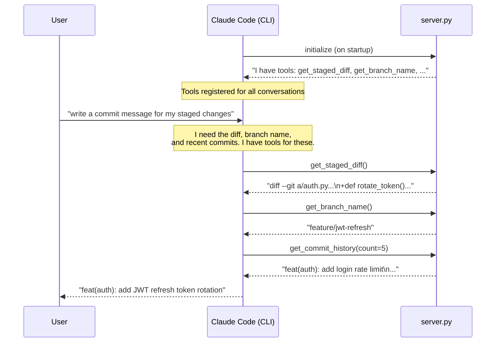
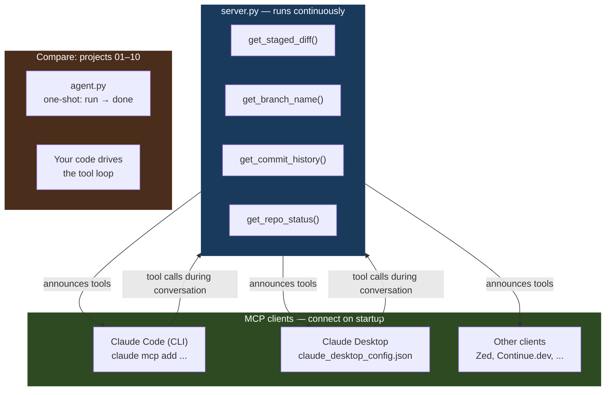

# 11 · mcp-server

> **Concept: MCP Server & Claude Code Integration** — instead of writing agent code, expose your tools as an MCP server and let Claude Code use them natively — in any conversation, without any Python glue code.

---

## What you will build

A Python MCP server that exposes 4 git tools. Once connected to Claude Code or Claude Desktop, Claude can call these tools in any conversation — no `agent.py`, no `dispatch()`, no API loop.

The 4 tools are the same git operations from project 01 (`git-narrator`), but this time they live in a **server process** rather than in your agent code:

| Tool | What it does |
|---|---|
| `get_staged_diff` | Returns `git diff --staged` output |
| `get_branch_name` | Returns the current branch name |
| `get_commit_history` | Returns the last N commit messages |
| `get_repo_status` | Returns `git status --short` output |

After connecting the server, open Claude Code in any git repository and type:

```
"Summarize my staged changes as a commit message"
```

Claude will automatically call `get_staged_diff`, `get_branch_name`, and `get_commit_history` — exactly as it would in project 01 — but without you writing any agent code. The MCP server provides the tools; Claude Code provides the agent loop.

---

## The concept: Model Context Protocol (MCP)

Projects 01–10 all used the Anthropic API directly. You wrote the tool definitions, the dispatch loop, the agent. Every project had the same skeleton:

```
user message
    → client.messages.create(tools=[...])
    → stop_reason == "tool_use" → run function → send result
    → stop_reason == "end_turn" → print output
```

MCP flips this model entirely.

Instead of your code calling Claude, **you run a server** that declares its tools. Any MCP-compatible client — Claude Code, Claude Desktop, Zed, Continue.dev — connects to your server on startup and can use your tools in any conversation, automatically.

**One server → many clients. Write once, use everywhere.**

### MCP vs API tool use — key differences

| | API tool use (projects 01–10) | MCP server (this project) |
|---|---|---|
| Where tools live | In your Python agent code | In a separate server process |
| Who writes the agent loop | You (`agent.py`) | The MCP client (Claude Code) |
| Tool discovery | You pass `tools=[...]` in every API call | Server announces capabilities on connect |
| Reusability | One agent only | Any MCP-compatible client |
| Configuration | In code | `claude_desktop_config.json` |
| Lifecycle | Run once per task | Server runs continuously |

### How it works — step by step



The key difference from project 01: Claude Code drives the entire tool loop. You never wrote a loop.

### The critical piece: `@mcp.tool()` decorator

In projects 01–10, every tool required three things:

1. A **definition dict** in your `TOOL_DEFINITIONS` list
2. A **dispatch case** in your `dispatch()` function
3. The **implementation** function itself

MCP collapses all three into one:

```python
@mcp.tool()
def get_staged_diff() -> str:
    """
    Returns the currently staged git diff (git diff --staged).
    Use this to see exactly which lines of code are about to be committed.
    """
    result = subprocess.run(["git", "diff", "--staged"], capture_output=True, text=True)
    return result.stdout.strip() or "No staged changes found."
```

The `@mcp.tool()` decorator:
- Registers the function as a tool (replaces `TOOL_DEFINITIONS`)
- Infers the name from the function name (`get_staged_diff`)
- Infers the description from the **docstring** — Claude reads this to decide when to call the tool
- Infers the input schema from the **type annotations**
- Handles dispatch automatically (no `dispatch()` function needed)

Compare project 01's equivalent — same git operation, much more boilerplate:

```python
# Project 01: three separate pieces for every tool

# 1. In TOOL_DEFINITIONS list
{
    "name": "run_git_diff",
    "description": "Returns the staged git diff (git diff --staged). "
                   "Use this to see exactly what code changes are about to be committed.",
    "input_schema": {"type": "object", "properties": {}}
},

# 2. In dispatch() function
case "run_git_diff":
    return run_git_diff()

# 3. The implementation
def run_git_diff() -> str:
    result = subprocess.run(["git", "diff", "--staged"], capture_output=True, text=True)
    return result.stdout or "No staged changes found."
```

With MCP, the decorator + docstring replace pieces 1 and 2 entirely.

**The docstring is still everything.** Just as in project 01, Claude decides when to call a tool based on its description. A bad docstring means Claude won't call the tool at the right time — this principle is identical in both approaches.

### FastMCP vs raw MCP SDK

The `mcp` package is the official Anthropic MCP Python SDK. It ships two layers:

- **`FastMCP`** — high-level wrapper that handles protocol details automatically. Analogous to FastAPI vs raw ASGI. Use this for tool servers.
- **Raw MCP SDK** — lower-level, required for advanced features: resources (read-only data sources), prompts (reusable prompt templates), server-side sampling. Use this when you need those features.

For a tool server like this one, `FastMCP` is the right choice.

---

## Architecture



The critical architectural difference: in projects 01–10, your `agent.py` process lived for the duration of one task and drove the tool loop. In this project, `server.py` is a **long-running process** that waits for connections. The client (Claude Code) drives the tool loop for every conversation, forever.

---

## File structure

```
11-mcp-server/
├── README.md
├── server.py                    ← the MCP server (4 git tools)
└── claude_desktop_config.json   ← ready-to-use config snippet
```

No `agent.py`. No `tools.py` with a separate definitions list. No `dispatch()`. The server is the agent.

---

## Step-by-step walkthrough

### Step 1 — Install the MCP package

```bash
cd 11-mcp-server

python3 -m venv .venv
source .venv/bin/activate        # macOS / Linux
# .venv\Scripts\activate         # Windows

pip install mcp anthropic
```

> The `anthropic` package is included here for consistency with the rest of the series. `server.py` only requires `mcp` — but having `anthropic` installed lets you explore hybrid patterns if you want to extend the server later.

### Step 2 — Run the server (test it works)

```bash
python3 server.py
```

You should see output like:

```
Starting MCP server 'git-tools'...
```

The server blocks, waiting for an MCP client to connect. Press `Ctrl+C` to stop it. If you see `ModuleNotFoundError: mcp`, run `pip install mcp` and confirm your venv is active.

### Step 3 — Connect to Claude Desktop

Claude Desktop reads a config file on startup and connects to every server listed under `mcpServers`.

1. Open (or create) the config file:
   - **macOS**: `~/Library/Application Support/Claude/claude_desktop_config.json`
   - **Windows**: `%APPDATA%\Claude\claude_desktop_config.json`

2. Add the `git-tools` entry from `claude_desktop_config.json` in this project. Update the path to point to your actual `server.py`:

```json
{
  "mcpServers": {
    "git-tools": {
      "command": "python3",
      "args": ["/Users/yourname/ai-agent-fundamentals/11-mcp-server/server.py"]
    }
  }
}
```

3. Restart Claude Desktop completely (quit and reopen — not just close the window).

4. Open a new conversation. Look for the tools icon (hammer icon) in the input area. You should see `get_staged_diff`, `get_branch_name`, `get_commit_history`, and `get_repo_status` listed.

5. Test it: type `"What branch am I on?"` — Claude should call `get_branch_name` automatically.

### Step 4 — Connect to Claude Code (CLI)

```bash
# Register the server with Claude Code
claude mcp add git-tools python3 /absolute/path/to/11-mcp-server/server.py

# Verify it was registered
claude mcp list

# Expected output:
# git-tools: python3 /absolute/path/to/11-mcp-server/server.py
```

Claude Code starts `server.py` automatically whenever it starts a conversation. The tools are available in every session without any further setup.

```bash
# Test in a conversation
claude "what is the current git status of this repo?"
# Claude will call get_repo_status() and report back
```

### Step 5 — Use it in a real workflow

In any git repository:

```bash
# Stage some changes
git add auth.py

# Ask Claude to write a commit message
claude "write a conventional commit message for my staged changes"
```

Claude will call `get_staged_diff()` to read the diff, `get_branch_name()` for context, and `get_commit_history()` to match your project's commit style — then produce a commit message. Same output as project 01's `agent.py`, but you ran zero Python.

---

## Configuration reference

### macOS config path

```
~/Library/Application Support/Claude/claude_desktop_config.json
```

### Windows config path

```
%APPDATA%\Claude\claude_desktop_config.json
```

### Minimal config (quickstart)

```json
{
  "mcpServers": {
    "git-tools": {
      "command": "python3",
      "args": ["/Users/yourname/ai-agent-fundamentals/11-mcp-server/server.py"]
    }
  }
}
```

### Using a venv (recommended for production)

If you installed `mcp` inside a virtualenv, point the `command` at the venv's Python binary so the right packages are found:

```json
{
  "mcpServers": {
    "git-tools": {
      "command": "/Users/yourname/ai-agent-fundamentals/11-mcp-server/.venv/bin/python3",
      "args": ["/Users/yourname/ai-agent-fundamentals/11-mcp-server/server.py"]
    }
  }
}
```

### Multiple servers

You can register as many servers as you like. Each gets a key under `mcpServers`:

```json
{
  "mcpServers": {
    "git-tools": {
      "command": "python3",
      "args": ["/path/to/11-mcp-server/server.py"]
    },
    "my-other-server": {
      "command": "python3",
      "args": ["/path/to/other-server/server.py"]
    }
  }
}
```

### Passing environment variables

If your server needs secrets (e.g. an API key), pass them via `env` in the config rather than hardcoding them:

```json
{
  "mcpServers": {
    "git-tools": {
      "command": "python3",
      "args": ["/path/to/server.py"],
      "env": {
        "ANTHROPIC_API_KEY": "sk-ant-..."
      }
    }
  }
}
```

---

## Run it

### Prerequisites

```bash
python3 -m venv .venv
source .venv/bin/activate
pip install mcp anthropic
```

### Test the server starts

```bash
python3 server.py
# Expected: MCP server starts, waits for connections
# Press Ctrl+C to stop
```

### Connect to Claude Code CLI

```bash
claude mcp add git-tools python3 $(pwd)/server.py
claude mcp list   # verify it appears
```

### Remove from Claude Code CLI

```bash
claude mcp remove git-tools
```

### Troubleshooting

| Symptom | Likely cause | Fix |
|---|---|---|
| `ModuleNotFoundError: mcp` | Package not installed | `pip install mcp` |
| Server starts but tools don't appear in Claude Desktop | Wrong path in config | Use absolute path; no `~/` shortcuts |
| `git error: not a git repository` | Running outside a git repo | `cd` into a git repo before asking Claude |
| Claude Code doesn't show MCP tools | Config not reloaded | Restart Claude Code completely |
| `python3: command not found` | Python not in PATH | Use full path: `/usr/bin/python3` or venv path |
| Tools appear but always return errors | Server process crashed | Check Claude Desktop logs: `~/Library/Logs/Claude/` |

---

## Exercises

1. **Add a new tool** — create a `get_file_diff(file_path: str)` tool that returns the diff for a specific file (`git diff -- <file_path>`). Notice that the type annotation on `file_path: str` is enough for FastMCP to generate the input schema automatically.

2. **Add a resource** — MCP supports "resources" (read-only data sources Claude can read on demand) in addition to tools. Use the raw MCP SDK to expose the current `README.md` as a resource. Resources are fetched differently from tools — they use `@mcp.resource()` and a URI scheme like `file://README.md`.

3. **Connect to another MCP client** — install a different MCP client (Zed, Continue.dev, or any other MCP-compatible editor) and connect the same `server.py`. The server does not change — only the config file location differs per client. This demonstrates the "write once, use everywhere" promise of MCP.

4. **Add a tool with side effects** — create a `create_commit(message: str)` tool that runs `git commit -m "<message>"`. Think carefully about what the docstring should say so Claude only calls this when the user explicitly asks to commit — not just when asking for a suggested message.

---

## How this relates to the Anthropic Certified Architect exam

Domain 2 (Claude Code Configuration & Workflows) covers 20% of the exam. This project addresses it directly.

### Exam topics covered here

| Exam topic | Where it appears in this project |
|---|---|
| MCP server setup and configuration | `server.py`, `claude_desktop_config.json`, Step 3–4 |
| `claude_desktop_config.json` structure | Configuration reference section above |
| Tool description best practices | The `@mcp.tool()` docstrings in `server.py` |
| Claude Code CLI integration | Step 4: `claude mcp add` |
| FastMCP vs raw MCP SDK | Explained in "The concept" section |
| Server process lifecycle | Architecture section |

### Key exam concepts to memorize

**The docstring is the tool description.** In both API tool use (projects 01–10) and MCP, the description is what Claude reads to decide when to call the tool. The syntax differs; the principle is identical. A tool with a vague docstring will be called at the wrong time or not at all.

**Absolute paths in config.** The single most common setup mistake. `~/` shorthand does not expand in `claude_desktop_config.json` in all clients. Always use a full path like `/Users/yourname/...`.

**FastMCP vs raw SDK.** FastMCP is the right choice for tool servers — it handles protocol negotiation, schema generation, and dispatch. The raw SDK is needed for resources, prompts, and custom transport layers.

**Server process lifecycle.** In projects 01–10, your agent process ran once per task. An MCP server runs continuously and handles connections from multiple clients over its lifetime. It must be stateless (or thread-safe if it holds state).

**MCP separates tool implementation from client logic.** Your server knows nothing about Claude Code or Claude Desktop. The MCP protocol defines the interface. This is the same separation of concerns as HTTP: your web server knows nothing about which browser is connecting.

---

## How this project connects to the rest of the series

Every project in this series taught one layer of the agent stack:

| Project | Concept | What you built |
|---|---|---|
| 01 · git-narrator | Tool use | The foundation: Claude calling Python functions |
| 02 · doc-oracle | RAG + memory | Giving Claude access to your own documents |
| 03 · shell-pilot | ReAct loop | Reason → Act → Observe, looping until done |
| 04 · standup-bot | Episodic memory | Context persisting across sessions |
| 05 · pr-review-crew | Multi-agent | Orchestrator + specialist agents |
| 06 · deploy-watchdog | Event-driven agents | Agents triggered by system events |
| 07 · incident-scribe | Structured output | Agents producing machine-readable reports |
| 08 · codebase-navigator | Long context | Agents reasoning over large inputs |
| 09 · config-drift-detector | Stateful agents | Agents tracking change over time |
| 10 · feature-flag-manager | Tool composition | Tools that call other tools |
| **11 · mcp-server** | **MCP / Claude Code** | **Tools as a reusable server — no agent code** |

Project 11 is the inversion of project 01. In project 01, you wrote everything: the tool definitions, the dispatch loop, the API call, the agent. In project 11, you write only the tools themselves — the `@mcp.tool()` functions — and the MCP protocol + Claude Code handle everything else.

The knowledge from project 01 (tool descriptions, input schemas, the importance of clear docstrings) is directly reused here. MCP didn't change the fundamentals — it moved where the plumbing lives.

---

## Key takeaways

- MCP separates tool implementation from agent logic — write once, use in any MCP-compatible client
- `@mcp.tool()` replaces `TOOL_DEFINITIONS` + `dispatch()` from all previous projects — the decorator infers name, schema, and routing from the function signature and docstring
- The docstring is the tool description — same principle as project 01, different syntax
- Configuration lives in `claude_desktop_config.json`, not in code — use absolute paths
- The server runs continuously; your agent code (projects 01–10) ran once per task
- MCP is the bridge between your tools and any Claude interface — Claude Code, Claude Desktop, or any third-party MCP client
