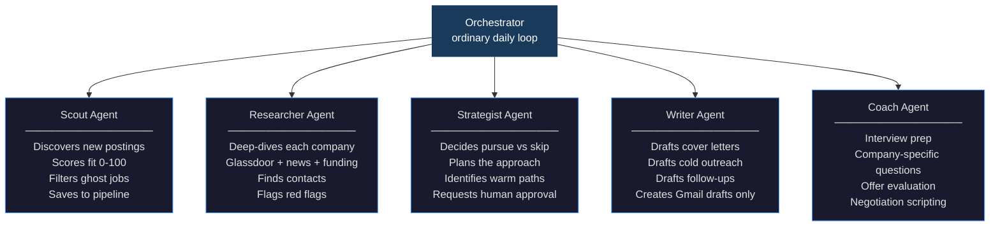
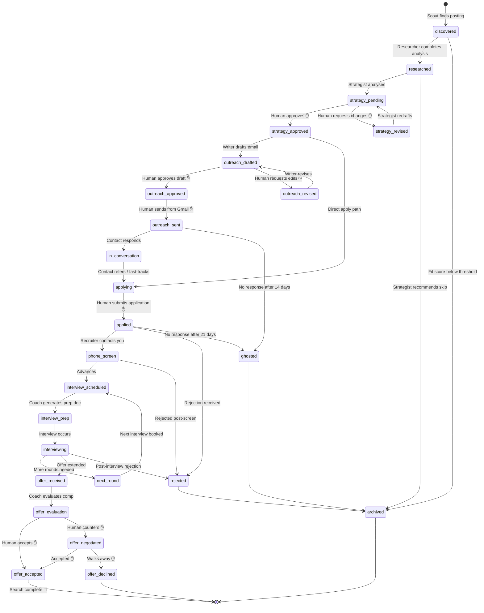
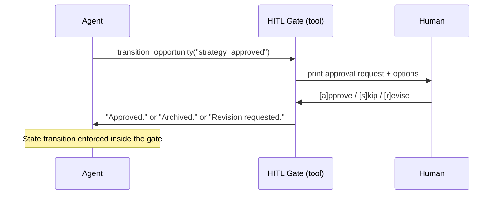
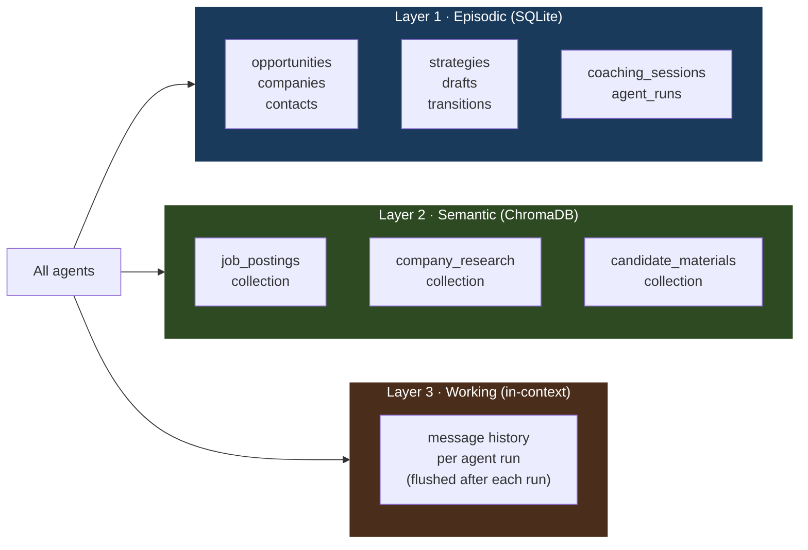
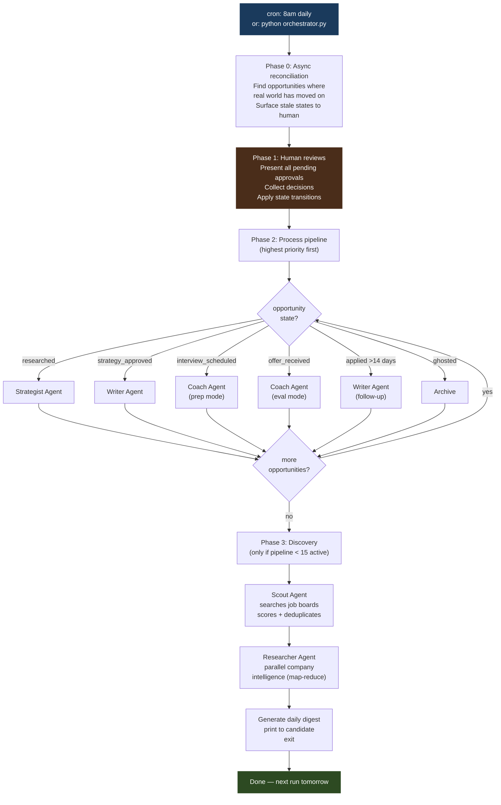
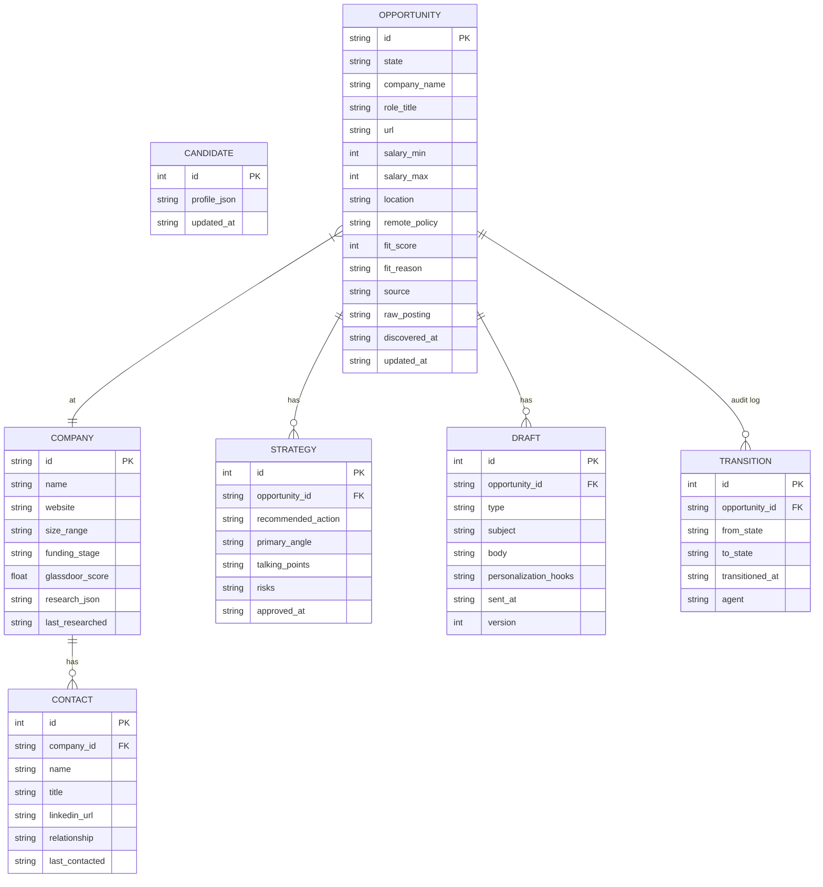

# 12 · job-search-assistant

> **Concept: Capstone — Full Agent System** — A multi-agent job search strategist that runs daily, manages the full hiring funnel from discovery to offer, and never sends anything without your approval.

This is the capstone project. It synthesizes every pattern from projects 01–11 into a single cohesive system. The goal is not to apply to more jobs faster — it's to apply to fewer jobs, but the right ones, with applications that actually convert.

---

## What you will build

A daily agent that:

1. **Discovers** real opportunities across job boards — and filters out ghost postings
2. **Researches** each company deeply before you invest any time
3. **Decides** whether to pursue or skip — and explains why
4. **Drafts** every piece of outreach, tailored to the specific company and role
5. **Preps** you for each interview with company-specific intelligence
6. **Evaluates** offers with real compensation benchmarks

```
Job Search Digest — 2026-05-24
──────────────────────────────────────────────────────
PIPELINE OVERVIEW
  Active opportunities: 8
  Pending your review:  3
  Interviews scheduled: 1 (Acme Corp — Tuesday 2pm)

NEEDS YOUR ATTENTION TODAY
  [1] Stripe — Staff Engineer
      Strategy drafted. Recommend: cold outreach to Maria Santos (mutual connection).

  [2] Notion — Engineering Manager
      Cover letter drafted. 342 words. Personalized to their recent Series C.
      → Gmail draft created. Review and send when ready.

  [3] Vercel — Principal Engineer
      SKIP recommended. Reason: role requires Go expertise (you listed as avoid).
      → Confirm skip or override.

WHAT THE AGENT DID TODAY
  Researched 2 new companies (Render, Railway)
  Archived 1 duplicate opportunity
  Drafted follow-up for Linear application (day 14, no response)

UPCOMING
  Acme Corp interview: Tuesday May 26, 2pm PST — prep doc ready
──────────────────────────────────────────────────────
```

The agent never sends anything. It creates Gmail drafts and waits for you to click send.

---

## Why this is the capstone

Every pattern from the series is required simultaneously:

| Pattern | From project | Role here |
|---|---|---|
| Tool Use | 01 | Every agent calls external APIs |
| RAG | 02 | Writer retrieves candidate's past approved drafts to match voice |
| ReAct Loop | 03 | Researcher chains web searches adaptively |
| Episodic Memory | 04 | SQLite persists the full pipeline across weeks |
| Multi-Agent | 05 | Five specialists coordinated by an orchestrator |
| Human-in-the-Loop | 06 | Six approval gates before any action is taken |
| Structured Output | 07 | Every agent saves via tool schema, not free text |
| Map-Reduce | 08 | Researcher processes multiple companies in parallel |
| Scheduled Agents | 09 | Orchestrator runs daily unattended |
| State Machine | 10 | Opportunity lifecycle enforced at tool level |
| MCP Server | 11 | Optional: expose pipeline as MCP for Claude Code queries |

The one new concept this adds: **async state reconciliation** — the world changes between runs. An interview gets rescheduled. A company announces layoffs. Each run starts by catching up with reality before executing any planned actions.

---

## The five agents



### Scout
Searches job boards (Indeed, Glassdoor, Greenhouse, Hacker News Who's Hiring), scores each posting 0–100 against your profile, deduplicates semantically (not just by URL), and saves new opportunities in `discovered` state. Only surfaces postings that score ≥ 60.

**Key tool**: `score_opportunity(posting, candidate_profile) → {score, reason, signals}`

**Ghost job detection signals**: posting age > 60 days, same JD reposted monthly, no Glassdoor reviews in the last 6 months, company headcount declining on LinkedIn.

### Researcher
For each new `discovered` opportunity, builds a complete company intelligence report: funding stage, headcount trend, Glassdoor score, recent news, known interview process, warm contacts from your LinkedIn export. Takes 3–8 web search calls per company via a ReAct loop.

**Key tool**: `save_company_research(company_id, research) → structured CompanyResearch object`

**LinkedIn strategy**: LinkedIn blocks scraping. Instead, the candidate downloads their own data export (Settings → Data Privacy → Get a copy of your data). This gives a CSV of all connections. The agent reads this locally — fully compliant, more reliable than scraping.

### Strategist
The highest-value agent. Given the full picture (your profile + company research + opportunity details), decides: **pursue**, **skip**, or **hold**. If pursue, decides the approach: cold outreach vs. direct apply, which angle to lead with, which contacts to approach. Never makes a move without human approval.

**Quality gate**: enforces a max of 15 active opportunities. If the pipeline is full, new discoveries are held until something closes. This enforces quality over quantity.

**Key tool**: `save_strategy(opportunity_id, {action, angle, contacts, talking_points, risks})`

### Writer
Drafts all outbound text — cover letters, cold emails, follow-ups, thank-you notes. Never sends. Always creates a Gmail draft and requests human review. Uses RAG over the candidate's past approved drafts to match their voice and avoid sounding like a template.

**Key invariant**: the Writer calls `create_gmail_draft()` — it cannot call any send function because no send function exists in its tool set.

**Key tool**: `save_draft(opportunity_id, {type, subject, body, personalization_hooks})`

### Coach
Activated at two moments: (1) before an interview — generates a prep document with company-specific questions, talking points, and logistical reminders; (2) when an offer arrives — models total compensation (base + bonus + equity + benefits), benchmarks against market data, and scripts the negotiation conversation.

**Key tool**: `save_coaching_session(opportunity_id, {type, content})`

---

## Opportunity state machine

The state machine is the backbone of the system. It follows the exact same enforcement pattern as `10-feature-flag-manager` — `transition_opportunity()` rejects invalid transitions at call time. No agent can skip a stage.



✋ = human-in-the-loop gate required before transition

---

## Human-in-the-loop gates

Six gates. All follow the project 06 pattern — the gate lives inside the tool function, not in Claude's reasoning. Claude cannot bypass a gate by being clever.



| Gate | Triggered when | Options |
|---|---|---|
| **Strategy approval** | Strategist recommends pursuing | approve / skip / revise |
| **Cold outreach review** | Writer drafts email or LinkedIn message | send / edit / discard |
| **Application review** | Cover letter drafted for formal application | submit / edit / defer |
| **Interview prep review** | Coach generates prep document | looks good / discuss |
| **Offer evaluation** | Coach completes compensation analysis | accept / negotiate / decline |
| **Daily digest** | Every morning before agent acts | override any planned action |

**The key invariant**: nothing leaves your machine without your explicit action. Gmail drafts are created — you click send. Application forms are linked — you submit them. The agent is a strategist and drafter, not an autonomous actor.

---

## Memory architecture

Three layers, combining projects 02 and 04.



**SQLite** (episodic, from project 04): Every opportunity, company, contact, draft, and state transition. Persists for the duration of the job search — weeks to months.

**ChromaDB** (semantic, from project 02): Three collections:
- `job_postings` — raw posting text, embedded for semantic deduplication
- `company_research` — research reports, retrieved by Writer and Coach
- `candidate_materials` — your approved past drafts, resume bullets, writing samples. This is what makes the Writer sound like you and not like ChatGPT.

**Working memory** (in-context, from every prior project): The message history within a single agent invocation. Each agent loads only the context it needs from SQLite/ChromaDB — never the entire database.

---

## Orchestration flow



**Priority ordering**: `offer_received` → `interviewing` → `interview_prep` → `phone_screen` → `applied` → `outreach_sent` → `strategy_approved` → `researched` → `discovered`

**Discovery throttle**: Scout only runs when the active pipeline is below 15 opportunities. This is the architectural enforcement of quality over quantity.

---

## Data model



---

## Tool inventory

### Job board tools
| Tool | Source | Notes |
|---|---|---|
| `search_indeed_jobs` | Indeed Publisher API | 500 calls/day free tier |
| `search_glassdoor_jobs` | Glassdoor Partner API | Includes company ratings |
| `search_greenhouse_jobs` | Greenhouse Job Board API | Public, no auth needed |
| `search_hn_who_is_hiring` | HN Algolia API | Parses monthly thread |
| `search_rss_feed` | RSS/Atom | Otta, Wellfound, RemoteOK |
| `read_linkedin_export` | Local CSV | Candidate imports their own data export |

### Research tools
| Tool | Source | Notes |
|---|---|---|
| `web_search` | Brave Search / Serper.dev | ~$0.50/1000 queries |
| `fetch_page` | httpx + BeautifulSoup | Respects robots.txt |
| `search_glassdoor_api` | Glassdoor Partner API | Reviews, ratings |
| `search_crunchbase` | Crunchbase Basic API | Funding, headcount |
| `search_news` | NewsAPI | Recent company news |
| `get_compensation_benchmarks` | Levels.fyi | Tech comp benchmarks |

### Communication tools
| Tool | Notes |
|---|---|
| `create_gmail_draft` | Gmail API (OAuth2). Creates draft only — never sends. |
| `list_gmail_drafts` | Checks if candidate sent a prior draft |
| `create_calendar_reminder` | Google Calendar — interview reminders |

### Memory tools (full list in `tools/definitions.py`)
`save_opportunity` · `get_opportunity` · `list_opportunities` · `transition_opportunity` · `upsert_company` · `get_company` · `upsert_contact` · `get_contacts_for_company` · `save_strategy` · `get_strategy` · `save_draft` · `get_drafts` · `save_coaching_session` · `search_rag` · `ingest_to_rag`

---

## Candidate profile (`data/candidate.yaml`)

```yaml
name: "Alex Chen"
current_title: "Senior Software Engineer"
years_experience: 8
current_salary: 135000
target_salary_min: 145000
target_salary_max: 200000

target_roles:
  - "Staff Engineer"
  - "Engineering Manager"
  - "Principal Engineer"

target_companies:
  preferred_size: ["50-500", "500-2000"]
  preferred_stage: ["Series B", "Series C", "public"]
  avoid: ["FAANG"]

location:
  current: "Austin, TX"
  willing_to_relocate: false
  remote_preference: "remote-first or hybrid"

skills:
  strong: ["Python", "distributed systems", "Kubernetes", "system design"]
  learning: ["Rust", "ML infrastructure"]
  avoid_roles_requiring: ["PHP", "Salesforce"]

constraints:
  notice_period_weeks: 4
  start_date_earliest: "2026-08-01"
  visa_sponsorship_needed: false

voice_and_style:
  cover_letter_tone: "direct, specific, no fluff"
  communication_style: "concise, technical but accessible"
  example_materials_path: "data/examples/"

search_status: "active"   # "active" | "passive" | "paused"
```

---

## File structure

```
12-job-search-assistant/
├── README.md                     ← you are here
├── orchestrator.py               ← daily agent loop
├── state_machine.py              ← VALID_TRANSITIONS + transition enforcement
├── candidate_profile.py          ← loads and validates candidate.yaml
│
├── agents/
│   ├── scout.py                  ← discovers + scores opportunities
│   ├── researcher.py             ← company intelligence (ReAct loop)
│   ├── strategist.py             ← pursue vs skip decision
│   ├── writer.py                 ← drafts all communications
│   └── coach.py                  ← interview prep + offer evaluation
│
├── memory/
│   ├── db.py                     ← SQLite layer
│   ├── schema.sql                ← all table definitions
│   └── rag.py                    ← ChromaDB collections
│
├── tools/
│   ├── definitions.py            ← all tool schemas (DEFINITIONS lists)
│   ├── job_boards.py             ← Indeed, Glassdoor, Greenhouse, HN
│   ├── web_research.py           ← search, fetch, Crunchbase, news
│   ├── email.py                  ← Gmail draft creation
│   ├── calendar.py               ← Google Calendar integration
│   └── dispatch.py               ← central tool router
│
├── hitl/
│   └── gates.py                  ← all 6 human-in-the-loop gate functions
│
├── run.sh                        ← run once or set up as cron job
│
└── data/
    ├── candidate.yaml            ← your profile, goals, constraints
    ├── linkedin_connections.csv  ← exported from LinkedIn (gitignored)
    ├── examples/                 ← past cover letters / writing samples for RAG
    └── job_search.db             ← SQLite database (gitignored)
```

---

## Implementation plan

### Phase 1 — Foundation
- [ ] `memory/schema.sql` + `memory/db.py` — all tables, CRUD helpers
- [ ] `state_machine.py` — `VALID_TRANSITIONS` + `transition_opportunity()`
- [ ] `candidate_profile.py` — load + validate `candidate.yaml`
- [ ] `tools/definitions.py` — all tool schemas
- [ ] `tools/dispatch.py` — central router

### Phase 2 — Scout + Researcher
- [ ] `tools/job_boards.py` — Indeed, Greenhouse, HN integrations
- [ ] `tools/web_research.py` — search + fetch + Crunchbase + news
- [ ] `agents/scout.py` — discovery loop with fit scoring
- [ ] `agents/researcher.py` — company intelligence ReAct loop
- [ ] `memory/rag.py` — ChromaDB setup, ingest, search

### Phase 3 — Strategist + Writer
- [ ] `agents/strategist.py` — structured output via tool schema
- [ ] `tools/email.py` — Gmail API OAuth2 setup
- [ ] `agents/writer.py` — RAG-grounded drafts, Gmail draft creation
- [ ] `hitl/gates.py` — all 6 gate functions

### Phase 4 — Coach + Orchestrator
- [ ] `agents/coach.py` — prep doc + offer evaluation
- [ ] `tools/calendar.py` — Google Calendar integration
- [ ] `orchestrator.py` — daily loop, phase ordering, async reconciliation
- [ ] `run.sh` — cron setup instructions

### Phase 5 — MCP extension (project 11 integration)
- [ ] Expose job search DB as MCP server
- [ ] Claude Code can query: "How long have I been waiting on Stripe?"

---

## Dependencies

```
anthropic
chromadb
httpx
beautifulsoup4
pyyaml
google-api-python-client
google-auth-oauthlib
python-dotenv
mcp                      # Phase 5 only
```

---

## Key design decisions

**Quality over quantity** — the Scout is capped at 15 active opportunities. The agent won't chase volume. If the pipeline is full, new discoveries wait.

**LinkedIn without scraping** — LinkedIn actively blocks bots. Instead, the candidate exports their own connection data (a native LinkedIn feature). The agent reads this CSV locally. Fully compliant, more reliable.

**The agent never sends** — `create_gmail_draft()` exists. `send_email()` does not. This is not a prompt constraint — it's an architecture constraint. The tool set makes sending impossible.

**State machine over prompt rules** — "never skip the phone screen stage" cannot be enforced by a system prompt. It is enforced by `transition_opportunity()` rejecting invalid transitions. Claude can't bypass it by being clever.

**Voice preservation via RAG** — the Writer retrieves the candidate's own past approved drafts before generating new ones. The cover letters sound like a human wrote them because they are trained on examples of how that specific human writes.

**Async reconciliation first** — every orchestrator run starts by checking for stale state before executing any planned actions. The world moves faster than the agent runs. An interview gets rescheduled overnight. This phase catches it.

---

## Key takeaways

- Multi-agent systems need a **coordinator** with clear phase ordering — parallelism is for independent tasks, sequencing is for dependent ones
- **State machines are contracts** — with yourself, with the agent, and with the hiring process
- **HITL gates are architecture decisions** — they live in tool implementations, not system prompts
- **Memory at multiple timescales** — episodic (weeks of pipeline history), semantic (your writing voice), working (one agent run)
- The job search is a good model for any **long-horizon agentic task**: multi-week, async, high-stakes, human approval required before external action
