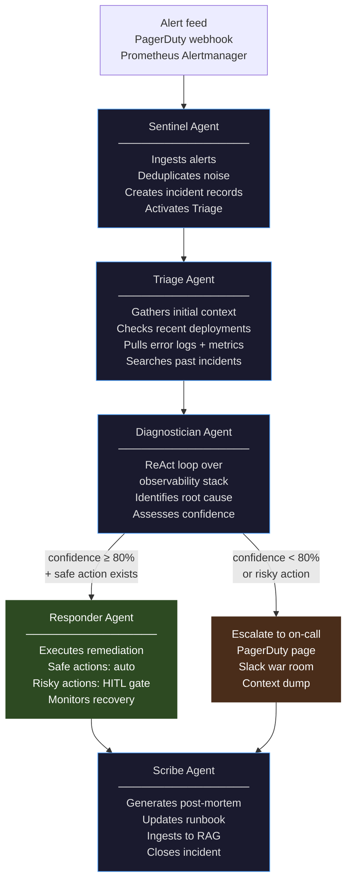
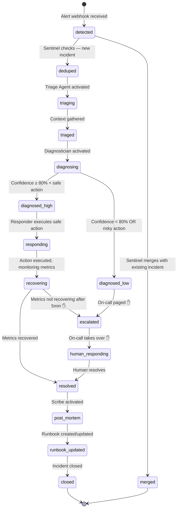
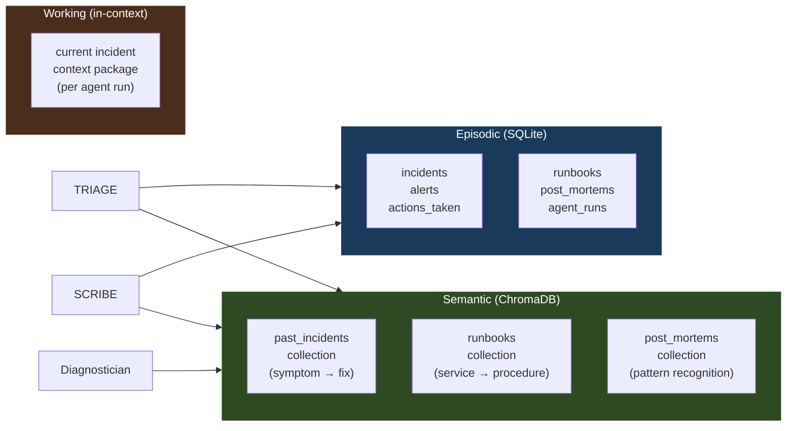
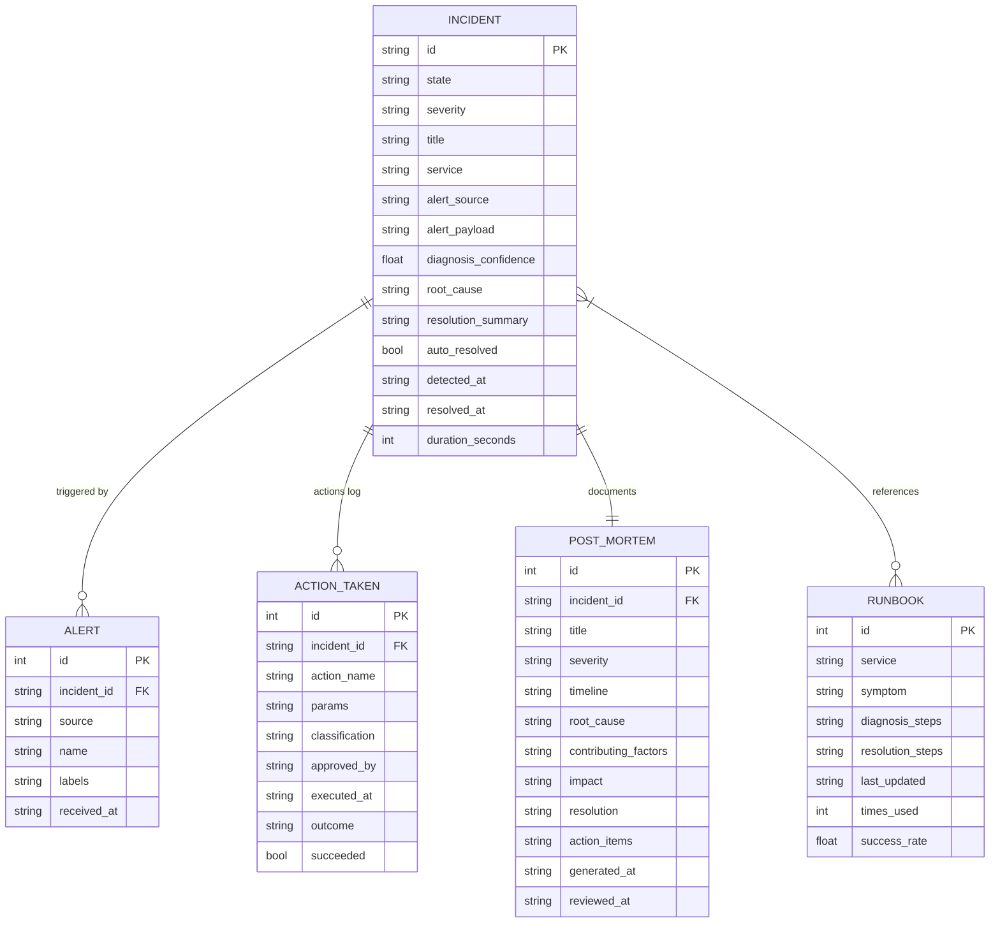
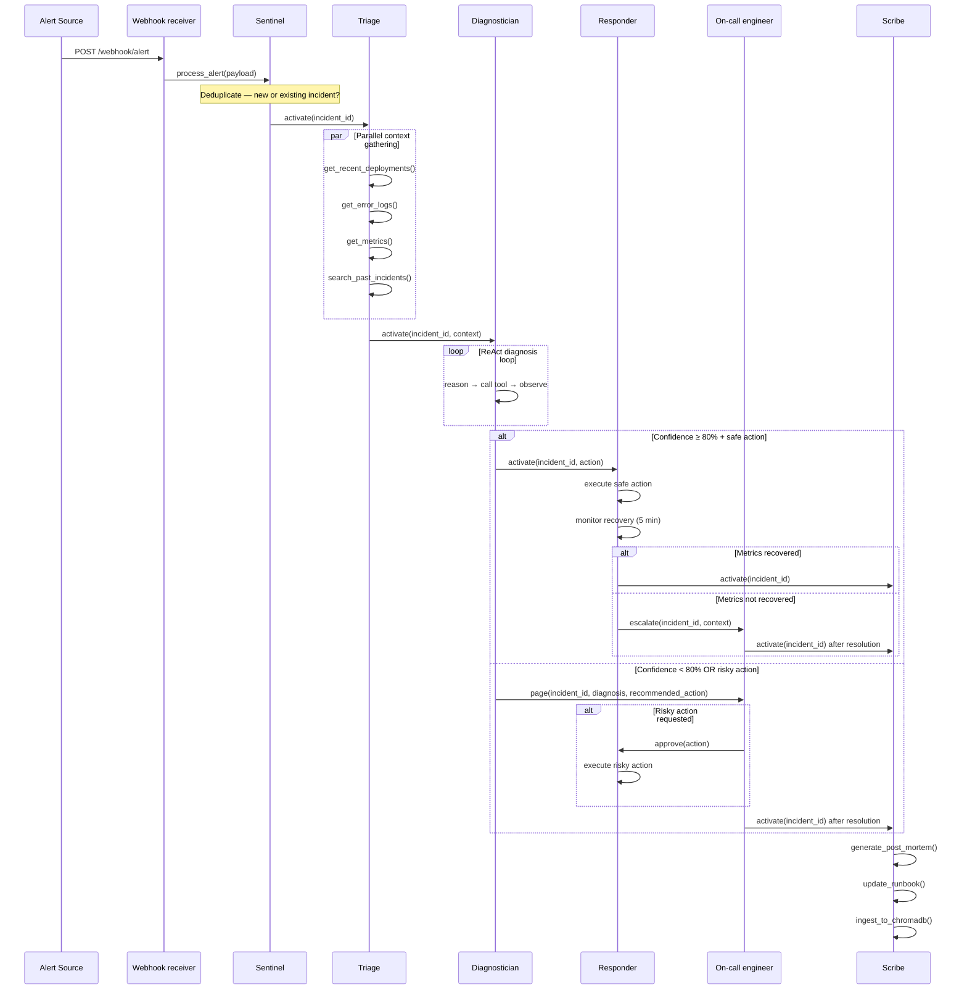

# 13 · sre-devops-agent

> **Concept: Autonomous SRE** — An always-on agent that monitors production, triages incidents, executes safe remediations autonomously, escalates risky actions to humans, and builds institutional knowledge over time.

This is a companion capstone to project 12. Where 12 is a long-horizon personal assistant (weeks, async, low urgency), this system operates at the other extreme: **real-time, high-stakes, minutes matter**. Every architectural decision reflects that difference.

---

## What you will build

A production SRE agent that:

1. **Monitors** alert feeds and metrics continuously — Prometheus, Datadog, PagerDuty
2. **Triages** each incident by gathering context from logs, deployments, and topology
3. **Diagnoses** root cause via a multi-step ReAct loop across your observability stack
4. **Responds** — executes safe actions autonomously (pod restart, cache flush, feature flag toggle) and escalates risky ones (rollback, scale-down, config change) to the on-call engineer
5. **Documents** — auto-generates post-mortems and updates runbooks after every incident
6. **Learns** — searches past incidents semantically to recognize patterns and apply known fixes

```
[14:03:22] 🔴 ALERT: payments-service error rate > 5% (currently 23%)
[14:03:23] → Triage Agent activated for INC-2847
[14:03:24]   calling tool: get_recent_deployments(service=payments-service, hours=2)
[14:03:25]   calling tool: get_error_logs(service=payments-service, minutes=5)
[14:03:27]   calling tool: get_metrics(service=payments-service, metrics=[error_rate, latency, saturation])
[14:03:29]   calling tool: search_past_incidents(symptoms="error rate spike payments")
[14:03:31] → Past incident match: INC-2341 (2026-03-14) — DB connection pool exhaustion
[14:03:32] → Diagnostician: root cause = DB connection pool exhausted (max=20, active=20)
[14:03:33] → Safe action available: restart payments-service pods (known fix from INC-2341)
[14:03:33]   calling tool: restart_pods(service=payments-service, reason="connection pool reset")
[14:03:38] ✓ Pod restart complete. Error rate: 23% → 0.8% (recovering)
[14:03:45] ✓ INC-2847 resolved. Duration: 23 seconds. Auto-resolved: yes.
[14:03:46] → Scribe Agent: generating post-mortem + updating runbook
```

---

## How this differs from project 12

| | 12 · job-search-assistant | 13 · sre-devops-agent |
|---|---|---|
| Time horizon | Weeks to months | Seconds to hours |
| Trigger | Cron (daily) | Event-driven (alert webhook) |
| Urgency | Low — review at leisure | High — MTTR is a metric |
| Human involvement | Always consults before acting | Acts first, consults for risky |
| Memory use | Builds pipeline over weeks | Searches past incidents for patterns |
| Output | Drafts, strategies | Live system changes |
| Failure mode | Missed opportunity | Production outage extended |

The key architectural difference: **safe-by-default autonomy**. Project 12 never acts without approval. This agent acts immediately on safe operations and escalates only when actions could cause harm.

---

## The five agents



### Sentinel
Receives alert webhooks from PagerDuty, Prometheus Alertmanager, or Datadog. Deduplicates — if 5 alerts fire for the same service in 60 seconds, it opens one incident, not five. Creates an incident record and activates the Triage agent.

**Key design**: Sentinel is lightweight and fast. It does no analysis — just intake, dedup, and handoff. MTTR starts here.

### Triage
Gathers the initial context package in parallel: recent deployments, error logs, key metrics (error rate, latency, saturation), and a semantic search over past incidents for similar symptoms. Takes 5–10 seconds. Everything goes into the incident record so all downstream agents share the same picture.

**Key tool**: `search_past_incidents(symptoms)` → searches ChromaDB over all resolved post-mortems. The match from INC-2341 in the example above is what enables auto-resolution in 23 seconds.

### Diagnostician
The reasoning agent. Runs a ReAct loop over the observability stack — reads metrics, queries logs, checks dependency health, inspects recent config changes, cross-references the triage context. Produces a structured diagnosis: `{root_cause, confidence, evidence, known_fix, action_required}`.

**Confidence threshold**: if confidence ≥ 80% AND a known safe action exists, routes to Responder. Below 80% OR if the required action is risky, escalates to on-call. The confidence check is enforced in the tool, not the prompt.

### Responder
Executes remediation. Has two action classes:

**Safe actions** (executed autonomously):
- Pod/container restart
- Cache flush
- Feature flag toggle (via `10-feature-flag-manager` pattern)
- Rate limit adjustment
- Connection pool reset
- DNS TTL override

**Risky actions** (require on-call approval via HITL gate):
- Deployment rollback
- Database failover
- Service scale-down
- Config change
- Traffic reroute
- Any action that modifies persistent state

After executing, monitors recovery metrics for 5 minutes. If metrics don't recover, escalates.

### Scribe
Activated after every incident closes — whether auto-resolved or human-resolved. Generates a structured post-mortem, updates or creates a runbook entry, and ingests both into ChromaDB. This is the learning loop: every incident makes the next one faster to resolve.

---

## Incident state machine



✋ = on-call engineer involved

---

## Safe vs risky action classification

This is the most important design decision. The classification lives in `tools/responder.py` as a hard-coded dict — not in a system prompt.

```python
# tools/responder.py

SAFE_ACTIONS = {
    "restart_pods",           # stateless, recovers in seconds
    "flush_cache",            # no data loss
    "toggle_feature_flag",    # instant rollback available
    "reset_connection_pool",  # config only, no state change
    "clear_rate_limit",       # additive, not destructive
    "scale_up",               # adding capacity, not removing
}

RISKY_ACTIONS = {
    "rollback_deployment",    # changes production code
    "scale_down",             # removes capacity
    "database_failover",      # highest blast radius
    "modify_config",          # persistent state change
    "reroute_traffic",        # affects all users
    "delete_resource",        # irreversible
}

def execute_action(action_name: str, params: dict) -> str:
    if action_name in SAFE_ACTIONS:
        return _execute(action_name, params)
    elif action_name in RISKY_ACTIONS:
        return _gate_risky_action(action_name, params)   # HITL gate
    else:
        return f"Error: unknown action '{action_name}'"
```

The Diagnostician can only request actions from this registry. It cannot invent new ones. The Responder cannot execute a risky action without going through the HITL gate. This is the same principle as project 10's state machine: **safety is enforced in code, not in prompts**.

---

## Human-in-the-loop gates

Three gates, ordered by urgency:

### Gate 1: Risky action approval (synchronous — blocks)
When the Responder needs to execute a risky action, it pages the on-call engineer and blocks. Timeout: 5 minutes. If no response, escalates to secondary on-call.

```
┌─────────────────────────────────────────────────────┐
│  ⚠️  APPROVAL REQUIRED — INC-2847                   │
│  Action:   rollback_deployment                      │
│  Service:  payments-service                         │
│  From:     v2.1.1 → v2.1.0                          │
│  Reason:   Error rate spike started 3 min after     │
│            deployment of v2.1.1 (14:00 UTC)         │
│  Evidence: 23% error rate, no DB issues found       │
│  Risk:     Affects all checkout transactions        │
│                                                     │
│  [Approve]  [Reject]  [Request more context]        │
│  Timeout: 4:32 remaining                            │
└─────────────────────────────────────────────────────┘
```

### Gate 2: Low-confidence escalation (async — pages on-call)
When the Diagnostician's confidence is below 80%, it doesn't block — it opens a PagerDuty incident, posts a Slack war-room summary, and waits for the human to take over. The full triage context is included so the engineer doesn't start from zero.

### Gate 3: Non-recovery escalation (async — pages on-call)
When the Responder executes a safe action but metrics don't recover within 5 minutes, it escalates. By this point the incident is 8–10 minutes old and needs human judgment.

---

## Memory architecture



**The learning loop**: every resolved incident → Scribe generates post-mortem → ingested into ChromaDB → next similar incident finds it via `search_past_incidents()` → faster diagnosis → potentially auto-resolved.

This is the compound interest of SRE: the agent gets better with every incident it sees.

---

## Tool inventory

### Observability tools
| Tool | Source | Notes |
|---|---|---|
| `get_metrics` | Prometheus API / Datadog API | Error rate, latency, saturation, traffic |
| `get_error_logs` | Loki / Datadog Logs / CloudWatch | Filtered by service + time window |
| `get_traces` | Jaeger / Tempo / Datadog APM | Distributed traces for a request ID |
| `get_service_topology` | Internal service mesh (Istio, Linkerd) | Dependency map |
| `get_dashboard` | Grafana API | Screenshot or JSON of a dashboard panel |
| `get_alert_history` | PagerDuty API | Past alerts for a service |

### Deployment tools
| Tool | Source | Notes |
|---|---|---|
| `get_recent_deployments` | GitHub Deployments API / ArgoCD | Last N deploys with timestamps |
| `get_deployment_diff` | GitHub API | What changed between versions |
| `get_open_prs` | GitHub API | PRs merged recently |
| `get_config_changes` | Git blame on config files | Recent config file changes |

### Kubernetes tools
| Tool | Source | Notes |
|---|---|---|
| `restart_pods` | kubectl / k8s API | **Safe action** |
| `scale_up` | kubectl / k8s API | **Safe action** |
| `scale_down` | kubectl / k8s API | **Risky action** — requires HITL |
| `get_pod_logs` | kubectl / k8s API | Last N lines from pod |
| `get_pod_status` | kubectl / k8s API | All pods for a service |
| `rollback_deployment` | kubectl / ArgoCD | **Risky action** — requires HITL |

### Communication tools
| Tool | Source | Notes |
|---|---|---|
| `page_oncall` | PagerDuty API | Opens incident, pages rotation |
| `create_war_room` | Slack API | Creates incident channel, invites team |
| `post_slack_message` | Slack API | Posts to incident channel |
| `update_status_page` | Statuspage.io API | Customer-facing status updates |
| `send_approval_request` | Slack / PagerDuty | HITL gate for risky actions |

### Feature flag tools (reuses project 10)
| Tool | Source | Notes |
|---|---|---|
| `toggle_feature_flag` | Internal (project 10) | **Safe action** — instant rollback |
| `get_flag_state` | Internal (project 10) | Check current flag state |

### Memory tools
| Tool | Notes |
|---|---|
| `search_past_incidents` | ChromaDB semantic search over post-mortems |
| `get_runbook` | ChromaDB search for service-specific runbooks |
| `save_incident` | SQLite — creates incident record |
| `update_incident` | SQLite — updates state, adds notes |
| `save_action_taken` | SQLite — audit log of every action |
| `save_post_mortem` | SQLite + ChromaDB ingest |
| `save_runbook` | SQLite + ChromaDB ingest |

---

## Incident data model



---

## Orchestration flow

Unlike project 12 (batch, daily), this system is **event-driven**. The trigger is a webhook, not a cron job.



---

## Web application layer

Same stack as project 12: FastAPI + HTMX + plain CSS.

### Pages

#### Incident feed (`/`)
Live feed of active and recent incidents. Color-coded by severity. Auto-refreshes via HTMX polling every 10 seconds.

```
┌─────────────────────────────────────────────────────────────────────┐
│  SRE Dashboard          2 active  ·  1 auto-resolved today          │
├──────────────────────────────────────────────────────────────────────┤
│                                                                      │
│  🔴 INC-2848  payments-service  P1  · 4 min ago  · DIAGNOSING      │
│     Error rate 18% · Diagnostician running (step 3/8)               │
│     [View]  [Take over]                                              │
│                                                                      │
│  🟡 INC-2847  api-gateway  P2  · 23 min ago  · RESOLVED ✓          │
│     Auto-resolved in 23s · Pod restart · Post-mortem pending        │
│     [View]  [Review post-mortem]                                     │
│                                                                      │
│  ─────────── Today's resolved incidents ────────────────────────    │
│  ✓ INC-2846  auth-service  P3  · 2h ago  · Auto-resolved in 41s   │
│                                                                      │
└─────────────────────────────────────────────────────────────────────┘
```

#### Incident detail (`/incident/:id`)
Real-time view of an active incident. Agent output streams via SSE. The HITL approval panel appears inline when a risky action is requested.

```
┌─────────────────────────────────────────────────────────────────────┐
│  INC-2848 · payments-service · P1 · DIAGNOSING                     │
├──────────────┬──────────────────────────────────────────────────────┤
│  Timeline    │  Agent output (live)                                  │
│              │                                                       │
│  14:03:22    │  → Triage activated                                   │
│  Alert       │    calling tool: get_recent_deployments(hours=2)     │
│              │    calling tool: get_error_logs(minutes=5)           │
│  14:03:27    │    calling tool: search_past_incidents(...)          │
│  Triaged     │    Match found: INC-2341 (DB pool exhaustion)        │
│              │                                                       │
│  14:03:29    │  → Diagnostician activated                           │
│  Diagnosing  │    calling tool: get_metrics(payments-service)       │
│  ●●●         │    calling tool: get_pod_status(payments-service)    │
│              │    [step 3 of ~8]                                     │
│              │                                                       │
│              ├──────────────────────────────────────────────────────┤
│              │  Context                                              │
│              │  Last deploy: v2.1.1 · 47 min ago                    │
│              │  Past match: INC-2341 — fix: pod restart             │
│              │  Confidence: building...                              │
└──────────────┴──────────────────────────────────────────────────────┘
```

When a risky action is requested, the HITL panel appears at the top of the page and a PagerDuty alert fires simultaneously:

```
┌─────────────────────────────────────────────────────────────────────┐
│  ⚠️  APPROVAL REQUIRED                                              │
│  rollback_deployment — payments-service v2.1.1 → v2.1.0            │
│  Confidence: 87% · Evidence: error spike 3min post-deploy           │
│  Timeout: 4:47                                                       │
│  [Approve ✓]  [Reject ✗]  [Ask for more context]                   │
└─────────────────────────────────────────────────────────────────────┘
```

#### Post-mortem review (`/incident/:id/post-mortem`)
Auto-generated post-mortem with inline editing. Human reviews, edits if needed, and approves. Approved post-mortems are ingested into ChromaDB.

#### Runbook library (`/runbooks`)
All runbooks, searchable by service and symptom. Shows how many times each runbook has been used and its success rate.

#### Analytics (`/analytics`)
MTTR over time, auto-resolution rate, most common root causes, services with most incidents, runbook hit rate.

---

### API routes

```
POST /webhook/alert                     ← PagerDuty / Alertmanager webhook
GET  /webhook/alert/test                ← test webhook with sample payload

GET  /api/incidents                     ← list incidents (filterable by state/severity)
GET  /api/incidents/:id                 ← full incident with all context
GET  /api/incidents/:id/stream          ← SSE stream of live agent output
POST /api/incidents/:id/takeover        ← human takes over from agent
POST /api/incidents/:id/resolve         ← human marks resolved

POST /api/approvals/:id/decide          ← {decision: approve|reject, notes}

GET  /api/runbooks                      ← list all runbooks
GET  /api/runbooks/:id                  ← single runbook
PUT  /api/runbooks/:id                  ← human edits a runbook
GET  /api/post-mortems                  ← list all post-mortems
GET  /api/post-mortems/:id              ← single post-mortem
POST /api/post-mortems/:id/approve      ← human approves, triggers RAG ingest

GET  /api/analytics/mttr                ← MTTR trend
GET  /api/analytics/auto-resolution     ← auto-resolution rate
GET  /api/analytics/top-causes          ← most common root causes
```

---

## File structure

```
13-sre-devops-agent/
├── README.md
│
├── web/
│   ├── main.py                       ← FastAPI app + webhook receiver
│   ├── routes/
│   │   ├── incidents.py
│   │   ├── approvals.py
│   │   ├── runbooks.py
│   │   ├── post_mortems.py
│   │   └── analytics.py
│   ├── templates/
│   │   ├── base.html
│   │   ├── feed.html                 ← live incident feed
│   │   ├── incident.html             ← detail + SSE agent output + HITL panel
│   │   ├── post_mortem.html          ← review + approve
│   │   ├── runbooks.html
│   │   └── analytics.html
│   └── static/
│       ├── style.css
│       └── htmx.min.js
│
├── agents/
│   ├── sentinel.py                   ← alert intake + dedup
│   ├── triage.py                     ← parallel context gathering
│   ├── diagnostician.py              ← ReAct root cause analysis
│   ├── responder.py                  ← safe/risky action execution
│   └── scribe.py                     ← post-mortem + runbook generation
│
├── memory/
│   ├── db.py                         ← SQLite layer
│   ├── schema.sql
│   └── rag.py                        ← ChromaDB (past incidents + runbooks)
│
├── tools/
│   ├── definitions.py                ← all tool schemas
│   ├── observability.py              ← metrics, logs, traces (Prometheus/Datadog)
│   ├── deployments.py                ← GitHub, ArgoCD
│   ├── kubernetes.py                 ← kubectl / k8s API
│   ├── communication.py              ← PagerDuty, Slack, Statuspage
│   ├── feature_flags.py              ← reuses project 10 pattern
│   └── dispatch.py
│
├── hitl/
│   └── gates.py                      ← risky action gate (async, DB-backed)
│
├── state_machine.py                  ← incident lifecycle enforcement
│
├── config/
│   ├── services.yaml                 ← service registry (owners, SLOs, runbook links)
│   ├── alert_rules.yaml              ← which alerts map to which triage playbooks
│   └── safe_actions.yaml            ← override safe/risky classification per service
│
├── tests/
│   ├── simulate_alert.py             ← sends a test webhook to trigger the full flow
│   └── sample_alerts/
│       ├── high_error_rate.json
│       ├── pod_crashloop.json
│       └── latency_spike.json
│
└── data/
    └── sre.db                        ← gitignored
```

---

## Configuration (`config/services.yaml`)

```yaml
services:
  payments-service:
    owner: "payments-team"
    slack_channel: "#payments-incidents"
    oncall_schedule: "payments-oncall"
    slo_error_rate: 0.5      # % threshold for P1
    slo_latency_p99: 500     # ms threshold for P1
    runbook: "https://wiki/payments-service-runbook"
    safe_actions:
      - restart_pods
      - flush_cache
      - toggle_feature_flag
    risky_actions:
      - rollback_deployment
      - scale_down
      - database_failover

  auth-service:
    owner: "platform-team"
    slack_channel: "#platform-incidents"
    oncall_schedule: "platform-oncall"
    slo_error_rate: 1.0
    slo_latency_p99: 200
```

This file is what makes the agent adaptable to any infrastructure without code changes. New service? Add a YAML block.

---

## Simulating an incident (for testing)

```bash
# Start the web server
uvicorn web.main:app --reload

# In another terminal, fire a test alert
python tests/simulate_alert.py --alert high_error_rate --service payments-service

# Watch the agent work in the browser
open http://localhost:8000
```

The `simulate_alert.py` script sends a realistic PagerDuty webhook payload to `/webhook/alert` and lets you watch the full triage → diagnosis → response flow without needing real infrastructure.

---

## Dependencies

```
anthropic
chromadb
httpx
beautifulsoup4
pyyaml
fastapi
uvicorn
kubernetes          # k8s Python client
slack-sdk
pdpyras             # PagerDuty Python client
prometheus-api-client
python-dotenv
```

---

## Implementation plan

### Phase 1 — Core infrastructure
- [ ] `memory/schema.sql` + `memory/db.py`
- [ ] `state_machine.py` — incident lifecycle
- [ ] `tools/definitions.py` + `tools/dispatch.py`
- [ ] `config/services.yaml` + config loader
- [ ] `tests/simulate_alert.py` + sample payloads

### Phase 2 — Sentinel + Triage
- [ ] `web/main.py` — FastAPI + webhook receiver
- [ ] `agents/sentinel.py` — alert intake, dedup
- [ ] `tools/observability.py` — metrics, logs, traces
- [ ] `tools/deployments.py` — GitHub, ArgoCD
- [ ] `agents/triage.py` — parallel context gathering
- [ ] `memory/rag.py` — ChromaDB setup

### Phase 3 — Diagnostician
- [ ] `agents/diagnostician.py` — ReAct loop
- [ ] Confidence scoring logic
- [ ] Safe vs risky routing

### Phase 4 — Responder + HITL
- [ ] `tools/kubernetes.py` — k8s API
- [ ] `tools/communication.py` — PagerDuty, Slack
- [ ] `hitl/gates.py` — async risky action gates
- [ ] `agents/responder.py` — execution + recovery monitoring

### Phase 5 — Scribe + learning loop
- [ ] `agents/scribe.py` — post-mortem generation
- [ ] Runbook creation and update
- [ ] ChromaDB ingest of resolved incidents
- [ ] Verify `search_past_incidents` improves over time

### Phase 6 — Web application
- [ ] All route files
- [ ] All templates (feed, incident detail, post-mortem, runbooks, analytics)
- [ ] SSE streaming for live agent output
- [ ] HITL approval panel in incident detail page

### Phase 7 — Deployment
- [ ] `Dockerfile`
- [ ] Fly.io / Railway config
- [ ] Persistent volumes for SQLite + ChromaDB
- [ ] Webhook URL configuration in PagerDuty / Alertmanager

---

## Key design decisions

**Event-driven, not cron** — an incident can't wait until 8am. The webhook receiver activates agents in milliseconds. The architecture is built around fast response time, not batch efficiency.

**Safe-by-default, not ask-by-default** — unlike project 12, this agent acts first and asks permission only when the risk warrants it. A pod restart that takes 10 seconds of human approval time could mean 10 seconds of extra downtime at 3am. Safe actions are clearly classified in code, not inferred by the LLM.

**Confidence gates in code** — `if confidence >= 0.80` is in `diagnostician.py`, not in the system prompt. The LLM reports a confidence score via structured output (project 07 pattern); the routing logic is a Python `if` statement.

**The learning loop is the moat** — every incident makes the next one faster. After 100 incidents, `search_past_incidents()` recognizes most common failure patterns and auto-resolves them in seconds. This is the compound value that takes months to build and is hard to replicate.

**Separate Scribe from Responder** — documentation is a different cognitive task from remediation. Keeping them as separate agents means the Responder stays focused on speed while the Scribe takes the time needed to write quality post-mortems and runbooks.

**Config-driven, not code-driven** — `services.yaml` defines what's safe to auto-remediate per service. A new microservice is onboarded with a YAML block, not a code change. The SRE team owns the config; developers own the services.

---

## Key takeaways

- **Event-driven agents** need different architecture than scheduled agents — low latency, parallel context gathering, immediate action
- **Safe vs risky** is a code classification, not a prompt constraint — it cannot be overridden by a clever system prompt
- **Confidence scoring** bridges the gap between "always act" and "always ask" — the threshold is tunable per service
- **The learning loop** is what separates a one-time script from a long-term platform — every incident improves the next response
- **Speed and safety can coexist** — safe actions are fast, risky actions are gated, the classification is explicit
