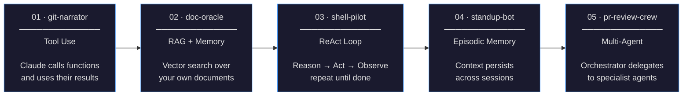
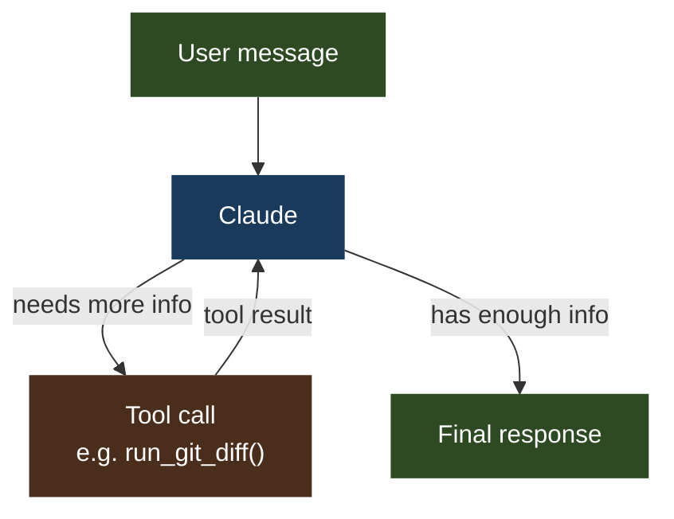

# AI Agent Fundamentals

> 5 hands-on projects to understand how AI agents actually work — from a single tool call to a crew of specialized agents collaborating on a task.

Each project teaches **one concept**, has **diagrams**, and is **runnable in under an hour**.

---

## Why this exists

Most tutorials show you *that* agents work. These projects show you *how* and *why* — by building each component from scratch, one at a time.

By the end, you will understand every moving part inside tools like LangChain, CrewAI, AutoGPT, or any production AI agent — because you will have built them yourself.

---

## The 5 concepts



---

## Projects at a glance

| # | Project | Concept | What you build | Time |
|---|---|---|---|---|
| 01 | [git-narrator](./01-git-narrator/) | Tool use | Agent that reads a git diff and writes commit messages + PR descriptions | ~2h |
| 02 | [doc-oracle](./02-doc-oracle/) | RAG + semantic memory | Agent that answers questions about your own docs with source citations | ~3h |
| 03 | [shell-pilot](./03-shell-pilot/) | ReAct loop | Agent that completes multi-step shell tasks and recovers from errors | ~3h |
| 04 | [standup-bot](./04-standup-bot/) | Episodic memory | Agent that tracks your daily work and remembers blockers across sessions | ~3h |
| 05 | [pr-review-crew](./05-pr-review-crew/) | Multi-agent | Orchestrator that delegates a PR to 3 specialist agents and synthesizes their feedback | ~4h |

---

## Getting started

### 1. Clone the repo

```bash
git clone https://github.com/wb-platform-engineering-lab/ai-agent-fundamentals.git
cd ai-agent-fundamentals
```

### 2. Create a virtual environment

```bash
python3 -m venv .venv
source .venv/bin/activate        # macOS / Linux
# .venv\Scripts\activate         # Windows
```

### 3. Install dependencies

```bash
pip install anthropic chromadb python-dotenv rich
```

### 4. Set your API key

Get a key at [console.anthropic.com](https://console.anthropic.com), then:

```bash
cp .env.example .env
# open .env and paste your key
```

Or export it directly:

```bash
export ANTHROPIC_API_KEY=sk-ant-...
```

### 5. Run your first project

```bash
cd 01-git-narrator
python3 agent.py
```

> Projects 02 and 04 require ChromaDB — already included in the pip install above. No external services needed.

---

## How to use this repo

Each project folder is self-contained:

```
01-git-narrator/
├── README.md      ← Start here. Concept explained, diagrams, step-by-step guide.
├── agent.py       ← The agent. Read it alongside the README.
├── tools.py       ← Tool definitions.
└── run.sh         ← Run the demo in one command.
```

**Recommended approach:**
1. Read the README fully before touching any code
2. Run the demo first: `bash run.sh`
3. Then read the code line by line with the README open
4. Do the exercises at the bottom of each README

---

## Core concept: what is an agent?

A regular LLM call: you send a message, you get a reply. Done.

An agent: Claude can call tools (functions), get their results, reason about them, call more tools, and keep going until the task is complete.



The key insight: **Claude decides** when to call a tool, which tool to call, and what arguments to pass. You define the tools — Claude figures out how and when to use them.

---

## Stack

- **LLM**: Claude (Anthropic SDK) — `claude-sonnet-4-6`
- **Vector DB**: ChromaDB (local, no server needed for dev)
- **Language**: Python 3.11+
- **No frameworks**: no LangChain, no LlamaIndex — raw Anthropic SDK so you see exactly what's happening
