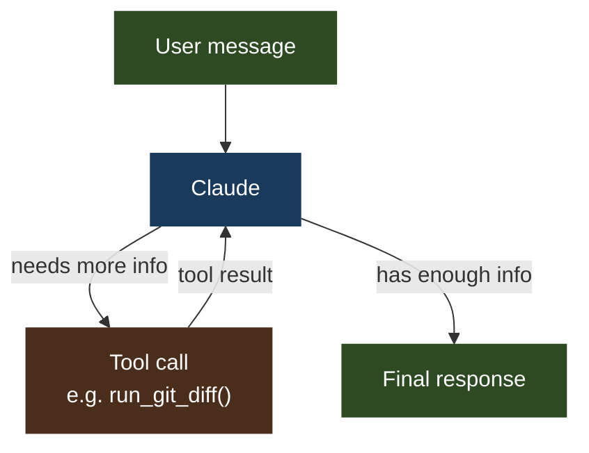

# AI Agent Fundamentals

> 13 hands-on projects to understand how AI agents actually work — from a single tool call to full production systems with web frontends, real-time streaming, and autonomous incident response.

Each project teaches **one concept**, has **diagrams**, and is **runnable in under an hour**.

---

## Why this exists

Most tutorials show you *that* agents work. These projects show you *how* and *why* — by building each component from scratch, one at a time.

By the end, you will understand every moving part inside tools like LangChain, CrewAI, AutoGPT, or any production AI agent — because you will have built them yourself.

Projects 01–05 cover the foundations. Projects 06–11 cover production patterns and together provide full coverage of all 5 domains of the **Anthropic Certified Architect (CCA-F)** exam. Projects 12–13 are full-stack capstone applications.

---

## The 11 concepts

```mermaid
flowchart LR
    subgraph Foundations
        P1["01 · git-narrator\n─────────────\nTool Use"]
        P2["02 · doc-oracle\n─────────────\nRAG"]
        P3["03 · shell-pilot\n─────────────\nReAct Loop"]
        P4["04 · standup-bot\n─────────────\nEpisodic Memory"]
        P5["05 · pr-review-crew\n─────────────\nMulti-Agent"]
    end

    subgraph Production
        P6["06 · deploy-watchdog\n─────────────\nHuman-in-the-Loop"]
        P7["07 · incident-scribe\n─────────────\nStructured Output"]
        P8["08 · codebase-navigator\n─────────────\nMap-Reduce"]
        P9["09 · config-drift-detector\n─────────────\nScheduled Agents"]
        P10["10 · feature-flag-manager\n─────────────\nState Machines"]
        P11["11 · mcp-server\n─────────────\nMCP + Claude Code"]
    end

    P1 --> P2 --> P3 --> P4 --> P5 --> P6
    P6 --> P7 --> P8 --> P9 --> P10 --> P11

    style P1 fill:#1a1a2e,color:#e0e0e0,stroke:#4a9eff
    style P2 fill:#1a1a2e,color:#e0e0e0,stroke:#4a9eff
    style P3 fill:#1a1a2e,color:#e0e0e0,stroke:#4a9eff
    style P4 fill:#1a1a2e,color:#e0e0e0,stroke:#4a9eff
    style P5 fill:#1a1a2e,color:#e0e0e0,stroke:#4a9eff
    style P6 fill:#2e1a1a,color:#e0e0e0,stroke:#ff6b4a
    style P7 fill:#2e1a1a,color:#e0e0e0,stroke:#ff6b4a
    style P8 fill:#2e1a1a,color:#e0e0e0,stroke:#ff6b4a
    style P9 fill:#2e1a1a,color:#e0e0e0,stroke:#ff6b4a
    style P10 fill:#2e1a1a,color:#e0e0e0,stroke:#ff6b4a
    style P11 fill:#2e1a1a,color:#e0e0e0,stroke:#ff6b4a
```



---

## Projects at a glance

### Foundations

| # | Project | Concept | What you build |
|---|---|---|---|
| 01 | [git-narrator](./01-git-narrator/) | Tool Use | Agent that reads a git diff and writes commit messages + PR descriptions |
| 02 | [doc-oracle](./02-doc-oracle/) | RAG + Semantic Memory | Agent that answers questions about your own docs with source citations |
| 03 | [shell-pilot](./03-shell-pilot/) | ReAct Loop | Agent that completes multi-step shell tasks and recovers from errors |
| 04 | [standup-bot](./04-standup-bot/) | Episodic Memory | Agent that tracks your daily work and remembers blockers across sessions |
| 05 | [pr-review-crew](./05-pr-review-crew/) | Multi-Agent Orchestration | Orchestrator that delegates a PR to 3 specialist agents and synthesizes their feedback |

### Production Patterns

| # | Project | Concept | What you build |
|---|---|---|---|
| 06 | [deploy-watchdog](./06-deploy-watchdog/) | Human-in-the-Loop | Agent that monitors a CI pipeline and gates deployments behind human approval |
| 07 | [incident-scribe](./07-incident-scribe/) | Structured Output | Agent that parses incident logs into validated JSON using tool schema enforcement |
| 08 | [codebase-navigator](./08-codebase-navigator/) | Hierarchical Summarization | Map-reduce agent that answers questions about codebases too large for one context window |
| 09 | [config-drift-detector](./09-config-drift-detector/) | Scheduled / Event-Driven | Unattended agent that compares desired vs. live infrastructure state and files a drift report |
| 10 | [feature-flag-manager](./10-feature-flag-manager/) | State Machine Agents | Agent that enforces valid feature flag lifecycle transitions at the tool level |
| 11 | [mcp-server](./11-mcp-server/) | MCP + Claude Code | Custom MCP server that exposes git tools to Claude Code and Claude Desktop |

### Capstone Applications

| # | Project | Concept | What you build |
|---|---|---|---|
| 12 | [job-search-assistant](./12-job-search-assistant/) | Full-stack agent system | Multi-agent job search strategist with pipeline management, HITL gates, and web dashboard |
| 13 | [sre-devops-agent](./13-sre-devops-agent/) | Autonomous SRE | Event-driven incident response agent that triages, diagnoses, auto-remediates, and learns |

---

## Anthropic Certified Architect exam coverage

These 11 projects together cover all 5 domains of the CCA-F exam:

| Exam Domain | Weight | Covered by |
|---|---|---|
| Agentic Architecture & Orchestration | 27% | 03, 05, 06, 09, 10 |
| Claude Code Configuration & Workflows | 20% | 11 |
| Prompt Engineering & Structured Output | 20% | 07, and exercises throughout |
| Tool Design & MCP Integration | 18% | 01, 07, 11 |
| Context Management & Reliability | 15% | 02, 04, 08 |

---

## Getting started

### 1. Clone the repo

```bash
git clone https://github.com/wb-platform-engineering-lab/ai-agent-fundamentals.git
cd ai-agent-fundamentals
```

### 2. Create a virtual environment

```bash
python3 -m venv .venv
source .venv/bin/activate        # macOS / Linux
# .venv\Scripts\activate         # Windows
```

### 3. Install dependencies

```bash
pip install anthropic chromadb python-dotenv pyyaml mcp
```

### 4. Set your API key

Get a key at [console.anthropic.com](https://console.anthropic.com), then:

```bash
export ANTHROPIC_API_KEY=sk-ant-...
```

### 5. Run your first project

```bash
cd 01-git-narrator
python3 agent.py
```

> **Per-project installs:** Each project README lists only the packages it needs. The command above installs everything for all 11 projects at once.

---

## How to use this repo

Each project folder is self-contained:

```
01-git-narrator/
├── README.md      ← Start here. Concept explained, diagrams, step-by-step guide.
├── agent.py       ← The agent. Read it alongside the README.
├── tools.py       ← Tool definitions and dispatch.
└── run.sh         ← Run the demo in one command.
```

**Recommended approach:**
1. Read the README fully before touching any code
2. Run the demo first: `bash run.sh` (or `python3 agent.py`)
3. Read the code line by line with the README open
4. Do the exercises at the bottom of each README

---

## Core concept: what is an agent?

A regular LLM call: you send a message, you get a reply. Done.

An agent: Claude can call tools (functions), get their results, reason about them, call more tools, and keep going until the task is complete.



The key insight: **Claude decides** when to call a tool, which tool to call, and what arguments to pass. You define the tools — Claude figures out how and when to use them.

---

## Stack

- **LLM**: Claude (Anthropic SDK) — `claude-sonnet-4-6`
- **Vector DB**: ChromaDB (local, no server needed) — projects 02, 04
- **MCP**: `mcp` Python SDK — project 11
- **Language**: Python 3.10+
- **No frameworks**: no LangChain, no LlamaIndex — raw Anthropic SDK so you see exactly what's happening
